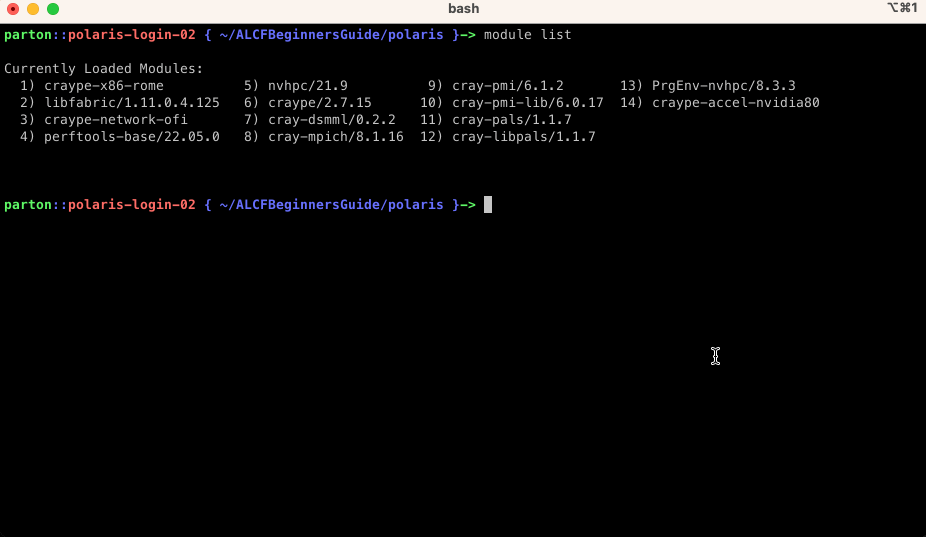
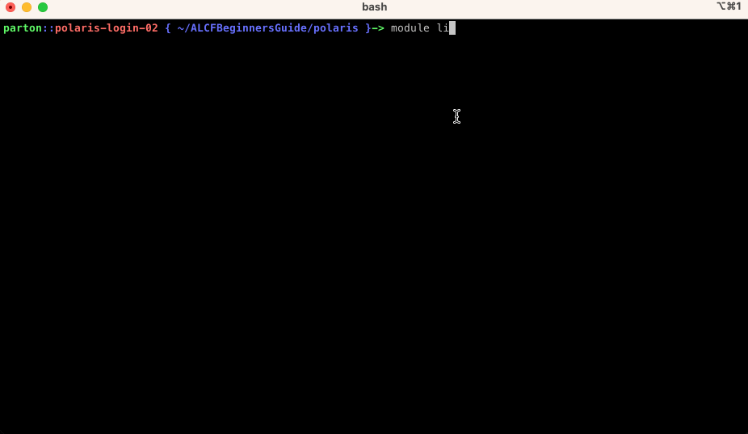

# Compilers on Aurora

This section describes how to compile C/C++ code standalone, with SYCL and OpenMP, and with MPI. Specifically it introduces the Intel software environment for compiling system compatible codes. The same flags apply to Fortran applications as well.

### User is assumed to know:
* how to compile and run code
* basic familiarity with MPI
* basic familiarity with SYCL and/or OpenMP
### Learning Goals:
* MPI compiler wrappers for oneAPI C/C++/FORTRAN compilers
* How to compile a C++ code
* How to compile a C++ code with SYCL and/or MPI
* How to compile a C++ code with OpenMP and/or MPI
* Modifications to job submission script when using MPI

# Compiling C/C++ code

When you first login to Aurora, there will be a default list of loaded modules (see them with `module list`). This includes the oneAPI suite of compilers, libraries, and tools and Cray MPICH. It is recommend to use the MPI compiler wrappers for building applications:
- `mpicc` - C compiler (use it like oneAPI `icx` or GNU `gcc`)
- `mpicxx` - C++ compiler (use it like oneAPI `icpx` or GNU `g++`)
- `mpif90` - Fortran compiler (use it like oneAPI `ifx` or GNU `gfortran`)

Next an example C++ code is compiled.

### Example code: [`01_example.cpp`](examples/01_example.cpp)
```c++
#include <iostream>

int main(void){

   std::cout << "Hello World!\n";
   return 0;
}
```

Build and run on an Aurora login node or worker node
```bash
mpicxx 01_example.cpp -o 01_example
./01_example
```

__NOTE:__ that this only uses the CPU. A GPU programming model, such as SYCL, OpenMP, or OpenCL (or HIP) is required to use the GPU.


# Compiling C/C++ with OpenMP

Users have the choice when compiling GPU-enabled applications to compile the GPU kernels at link-time or at runtime. Delaying the compilation of GPU kernels to runtime is referred to as Just-In-Time (JIT) compilation. Compiling the kernels while linking the application is referred to Ahead-Of-Time (AOT) compilation. 

* AOT
  * Compile: -fiopenmp -fopenmp-targets=spir64_gen
  * Link: -fiopenmp -fopenmp-targets=spir64_gen -Xopenmp-target-backend "-device pvc"
* JIT
  * Compile: -fiopenmp -fopenmp-targets=spir64
  * Link: -fiopenmp -fopenmp-targets=spir64

Both options are available to users, though we recommend using AOT to reduce overhead of starting the application. The examples that follow use AOT compilation.

### Example code: [`01_example_openmp.cpp`](examples/01_example_openmp.cpp)

Next compile the example using on the login node:
```bash
mpicxx -fiopenmp -fopenmp-targets=spir64_gen -c 01_example_openmp.cpp
mpicxx -o 01_example_openmp -fiopenmp -fopenmp-targets=spir64_gen -Xopenmp-target-backend "-device pvc" 01_example_openmp.o
```

### Submit script: [`01_example_openmp.sh`](examples/01_example_openmp.sh)
```bash
#!/bin/bash -l
#PBS -l select=1
#PBS -l walltime=00:10:00
#PBS -q debug
#PBS -A <project-name>
#PBS -l filesystems=home
#PBS -o logs/
#PBS -e logs/

cd ${PBS_O_WORKDIR}

mpiexec -n 1 --ppn 1 ./01_example_openmp
```

and submit your job:
```bash
qsub -A <project-name> 01_example_openmp.sh
```

The output should look like this in the `logs/<jobID>.<hostname>.OU` file:
```
# of devices= 6
Rank 0 on host 6 running on GPU 0!
Using double-precision


Result is CORRECT!! :)
```

Chris stopped here...




# Compiling C/C++ with MPI

Now you can compile your C++ with CUDA code, but that will only run on a single Polaris node. In order to run the same application across many nodes MPI is needed. The previous code can be augmented as follows to utilize MPI in a trivial way.

### Example Code: [`01_example_mpi.cu`](examples/01_example_mpi.cu)


### Building the code

On Polaris, when you login there is a module for MPI already loaded, named `cray-mpich` which is a custom build of the [MPICH](https://www.mpich.org/) MPI library. It defines the location of the library installed via the environment variable `MPICH_DIR`. In order to build our code

```bash
CC 01_example_mpi.cu -o 01_example_mpi
```


### Running the code: [`01_example_mpi.sh`](examples/01_example_mpi.sh)

Next this bash script can be used to submit a 2 node job with 8 ranks, 4 per node.

```bash
#!/bin/bash
#PBS -l select=2
#PBS -l walltime=00:10:00
#PBS -q debug
#PBS -l filesystems=home
#PBS -A datascience
#PBS -o logs/
#PBS -e logs/

# Count number of nodes assigned
NNODES=`wc -l < $PBS_NODEFILE`
# set 1 MPI rank per GPU
NRANKS_PER_NODE=4
# calculate total ranks
NTOTRANKS=$(( NNODES * NRANKS_PER_NODE ))
echo "NUM_OF_NODES= ${NNODES} TOTAL_NUM_RANKS= ${NTOTRANKS} RANKS_PER_NODE= ${NRANKS_PER_NODE}

mpiexec -n ${NTOTRANKS} --ppn ${NRANKS_PER_NODE} --hostfile ${PBS_NODEFILE} /home/parton/ALCFBeginnersGuide/polaris/examples/01_example_mpi

```



# CPU Affinity

# GPU Affinity


# [NEXT ->](02_profiling.md)
