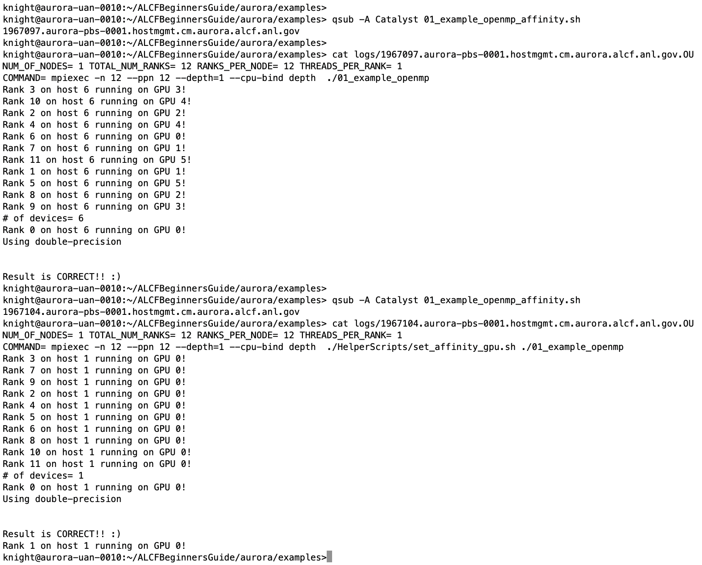

# Compilers on Aurora

This section describes how to compile C/C++ code standalone, with SYCL and OpenMP, and with MPI. Specifically it introduces the Intel software environment for compiling system compatible codes. The same flags apply to Fortran applications as well.

### User is assumed to know:
* how to compile and run code
* basic familiarity with MPI
* basic familiarity with SYCL and/or OpenMP
### Learning Goals:
* MPI compiler wrappers for oneAPI C/C++/FORTRAN compilers
* How to compile a C++ code
* How to compile a C++ code with SYCL and MPI
* How to compile a C++ code with OpenMP and MPI
* How to control CPU and GPU affinities in job scripts

# Compiling C/C++ code

When you first login to Aurora, there will be a default list of loaded modules (see them with `module list`). This includes the oneAPI suite of compilers, libraries, and tools and Cray MPICH. It is recommend to use the MPI compiler wrappers for building applications:
- `mpicc` - C compiler (use it like oneAPI `icx` or GNU `gcc`)
- `mpicxx` - C++ compiler (use it like oneAPI `icpx` or GNU `g++`)
- `mpif90` - Fortran compiler (use it like oneAPI `ifx` or GNU `gfortran`)

Next an example C++ code is compiled.

### Example code: [`01_example.cpp`](examples/01_example.cpp)
```c++
#include <iostream>

int main(void){

   std::cout << "Hello World!\n";
   return 0;
}
```

Build and run on an Aurora login node or worker node
```bash
mpicxx 01_example.cpp -o 01_example
./01_example
```

__NOTE:__ that this only uses the CPU. A GPU programming model, such as SYCL, OpenMP, or OpenCL (or HIP) is required to use the GPU.


# Compiling C/C++ with OpenMP

Users have the choice when compiling GPU-enabled applications to compile the GPU kernels at link-time or at runtime. Delaying the compilation of GPU kernels to runtime is referred to as Just-In-Time (JIT) compilation. Compiling the kernels while linking the application is referred to Ahead-Of-Time (AOT) compilation. 

* AOT
  * Compile: -fiopenmp -fopenmp-targets=spir64_gen
  * Link: -fiopenmp -fopenmp-targets=spir64_gen -Xopenmp-target-backend "-device pvc"
* JIT
  * Compile: -fiopenmp -fopenmp-targets=spir64
  * Link: -fiopenmp -fopenmp-targets=spir64

Both options are available to users, though we recommend using AOT to reduce overhead of starting the application. The examples that follow use AOT compilation.

### Example code: [`01_example_openmp.cpp`](examples/01_example_openmp.cpp)

Next compile the example on the login node:
```bash
mpicxx -fiopenmp -fopenmp-targets=spir64_gen -c 01_example_openmp.cpp
mpicxx -o 01_example_openmp -fiopenmp -fopenmp-targets=spir64_gen -Xopenmp-target-backend "-device pvc" 01_example_openmp.o
```

### Running the code: [`01_example_openmp.sh`](examples/01_example_openmp.sh)
```bash
#!/bin/bash -l
#PBS -l select=1
#PBS -l walltime=00:10:00
#PBS -q debug
#PBS -A <project-name>
#PBS -l filesystems=home:flare
#PBS -o logs/
#PBS -e logs/

cd ${PBS_O_WORKDIR}

mpiexec -n 1 --ppn 1 ./01_example_openmp
```

and submit your job:
```bash
qsub -A <project-name> 01_example_openmp.sh
```

The output should look like this in the `logs/<jobID>.<hostname>.OU` file:
```
# of devices= 6
Rank 0 on host 6 running on GPU 0!
Using double-precision


Result is CORRECT!! :)
```


# Compiling C/C++ with SYCL

Now you can compile your C/C++ with SYCL code. Users again have the choice of JIT or AOT compilation.

* AOT
  * Compile: --intel -fsycl  -fsycl-targets=spir64_gen
  * Link: --intel -fsycl  -fsycl-targets=spir64_gen -Xsycl-target-backend "-device pvc"
* JIT
  * Compile: --intel -fsycl  -fsycl-targets=spir64
  * Link: --intel -fsycl  -fsycl-targets=spir64

### Example Code: [`01_example_sycl.cpp`](examples/01_example_sycl.cpp)

Next compile the example on the login node.

```bash
mpicxx --intel -fsycl  -fsycl-targets=spir64_gen -c 01_example_sycl.cpp
mpicxx -o 01_example_sycl --intel -fsycl  -fsycl-targets=spir64_gen -Xsycl-target-backend "-device pvc" 01_example_sycl.o
```

### Running the code: [`01_example_sycl.sh`](examples/01_example_sycl.sh)

Next this bash script can be used to submit a 1 node job with a 1 MPI rank.

```bash
#!/bin/bash -l
#PBS -l select=1
#PBS -l walltime=00:10:00
#PBS -q debug
#PBS -A <project-name>
#PBS -l filesystems=home:flare
#PBS -o logs/
#PBS -e logs/

cd ${PBS_O_WORKDIR}

mpiexec -n 1 --ppn 1 ./01_example_sycl
```


# CPU Affinity and NUMA domains

Each Aurora node consists of dual 52-core CPUs, each with 2 hyperthreads. Output of the `lscpu` command can be used to quickly identify the CPU ids for cores in the two sockets.

```bash
knight@x4105c5s5b0n0:~> lscpu 
Architecture:            x86_64
  CPU op-mode(s):        32-bit, 64-bit
  Address sizes:         52 bits physical, 57 bits virtual
  Byte Order:            Little Endian
CPU(s):                  208
  On-line CPU(s) list:   0-207
Vendor ID:               GenuineIntel
  Model name:            Intel(R) Xeon(R) CPU Max 9470C
    CPU family:          6
    Model:               143
    Thread(s) per core:  2
    Core(s) per socket:  52
    Socket(s):           2
    Stepping:            8
    Frequency boost:     enabled
    CPU max MHz:         2001.0000
    CPU min MHz:         800.0000
...
NUMA:                    
  NUMA node(s):          4
  NUMA node0 CPU(s):     0-51,104-155
  NUMA node1 CPU(s):     52-103,156-207
  NUMA node2 CPU(s):     
  NUMA node3 CPU(s):     
...
```
Looking at the first two NUMA domains, we see that CPU cores 0-51 are in the first socket and CPU cores 52-103 in the second socket. The hyperthreads on each socket are CPU cores 104-155 and 156-207. Additional information on CPU frequencies and cache sizes is also available for those interested.

A bit more detailed information on the NUMA domains is obtained with the `numactl --hardware` command.

```bash
knight@x4105c5s5b0n0:~> numactl --hardware
available: 4 nodes (0-3)
node 0 cpus: 0 1 2 3 4 5 6 7 8 9 10 11 12 13 14 15 16 17 18 19 20 21 22 23 24 25 26 27 28 29 30 31 32 33 34 35 36 37 38 39 40 41 42 43 44 45 46 47 48 49 50 51 104 105 106 107 108 109 110 111 112 113 114 115 116 117 118 119 120 121 122 123 124 125 126 127 128 129 130 131 132 133 134 135 136 137 138 139 140 141 142 143 144 145 146 147 148 149 150 151 152 153 154 155
node 0 size: 515489 MB
node 0 free: 342653 MB
node 1 cpus: 52 53 54 55 56 57 58 59 60 61 62 63 64 65 66 67 68 69 70 71 72 73 74 75 76 77 78 79 80 81 82 83 84 85 86 87 88 89 90 91 92 93 94 95 96 97 98 99 100 101 102 103 156 157 158 159 160 161 162 163 164 165 166 167 168 169 170 171 172 173 174 175 176 177 178 179 180 181 182 183 184 185 186 187 188 189 190 191 192 193 194 195 196 197 198 199 200 201 202 203 204 205 206 207
node 1 size: 515028 MB
node 1 free: 508138 MB
node 2 cpus:
node 2 size: 65536 MB
node 2 free: 63977 MB
node 3 cpus:
node 3 size: 65536 MB
node 3 free: 64146 MB
node distances:
node   0   1   2   3 
  0:  10  21  13  23 
  1:  21  10  23  13 
  2:  13  23  10  23 
  3:  23  13  23  10 
```

Similar to the output from `lscpu` we see that cores `0-51,104-155` make up NUMA domain 0 and cores `52-103,156-207` make up NUMA domain 1. NUMA domains 2 and 3 are the HBM memories attached to each socket. In the `node distances` table, we see that the HBM for the first CPU is NUMA domain 2 and the HBM for the second CPU is NUMA domain 3. This information is useful for those users that would like to control how memory is allocated by their applications via `numactl` (e.g. prefer HBM or DDR).

As a means to quickly get started, one could opt for naively binding MPI ranks and processes to the CPU cores using `depth` logic whereby each MPI rank is assigned to a consecutive set of CPU cores.

For an application running 6 MPI ranks per node (1 per GPU) and each with 4 OpenMP threads on the host, one could set the depth as 4 (or something larger).

```bash
mpiexec -n 6 --ppn 6 --depth=4 --cpu-bind depth --env OMP_NUM_THREADS=4 ...
```

This is certainly appropriate for functionality testing, but depending on the application workload there may be performance impacts to only using the first socket. Better may be placing the first three MPI ranks on socket 0 and the second three MPI ranks on socket 1 such that each MPI rank is closest to its respective set of three GPUs. This can be achieved by passing an explicit list of CPU core IDs to assign to each MPI rank.

```bash
mpiexec -n 6 --ppn 6 --cpu-bind=list:0-3,4-7,8-11,52-55,56-59,60-63 --env OMP_NUM_THREADS=4 ...
```

Example code and submission scripts for testing different CPU affinity options are available in the GettingStarted examples [repo](https://github.com/argonne-lcf/GettingStarted/tree/master/Examples/Aurora/affinity_omp).

# GPU Affinity

Similar to the fare degree of flexibility in how one binds software processes to the CPU hardware, one can also bind processes to the GPU hardware at different levels. The default is that each of the 6 GPUs is viewed as a single device. Each Aurora GPU consists of two physical tiles and each can be targeted individually by applications. In other words, a typical configuration for an application may be to spawn 12 MPI ranks per compute node with each MPI rank bound to a single GPU tile. Furthermore, each GPU tile can be targeted in a more granular fashion  to bind MPI ranks to individual Compute Command Streamers (CCSs). The latter may prove beneficial when an application has considerable work on the CPUs that warrants additional parallelism. 

A set of helper scripts are provided which accept the local MPI rank ID as input and assigns the appropriate GPU hardware in a round-robin fashion. 

* ALCFBeginnersGuide/aurora/examples/HelperScripts
  * set_affinity_gpu.sh: bind MPI ranks to GPU tile
  * set_affinity_gpu_2ccs.sh: bind MPI ranks to 1/2 GPU tile
  * set affinity_gpu_4ccs.sh: bind MPI ranks to 1/4 GPU tile

## Example submission scripts: [`01_example_openmp_affinity.sh`](examples/01_example_openmp_affinity.sh) [`01_example_sycl_affinity.sh`](examples/01_example_sycl_affinity.sh)

This bash script can be used to submit a 1 node job with 12 MPI ranks, each bound to a single GPU tile.

```bash
#!/bin/bash -l
#PBS -l select=1
#PBS -l place=scatter
#PBS -l walltime=0:10:00
#PBS -q debug
#PBS -A <project-id>
#PBS -l filesystems=home:flare
#PBS -o logs/
#PBS -e logs/

cd ${PBS_O_WORKDIR}

NNODES=`wc -l < $PBS_NODEFILE`
NRANKS_PER_NODE=12
NDEPTH=1
NTHREADS=1

NTOTRANKS=$(( NNODES * NRANKS_PER_NODE ))
echo "NUM_OF_NODES= ${NNODES} TOTAL_NUM_RANKS= ${NTOTRANKS} RANKS_PER_NODE= ${NRANKS_PER_NODE} THREADS_PER_RANK= ${NTHREADS}"

EXE=./01_example_openmp

MPI_ARG="-n ${NTOTRANKS} --ppn ${NRANKS_PER_NODE} --depth=${NDEPTH} --cpu-bind depth "

AFFINITY=""
#AFFINITY="./HelperScripts/set_affinity_gpu_4ccs.sh"
#AFFINITY="./HelperScripts/set_affinity_gpu_2ccs.sh"
AFFINITY="./HelperScripts/set_affinity_gpu.sh"

COMMAND="mpiexec ${MPI_ARG} ${EXE}"
echo "COMMAND= ${COMMAND}"
${COMMAND}

```



This test code has support for detecting the number of devices available and binding devices to MPI ranks itself. However, in the first example there are 2 MPI ranks sharing the entire GPU (i.e. both tiles). In the second example, the helper script `set_affinity_gpu.sh` only exposes a single GPU tile. The 2 MPI ranks being bound to individual GPU tiles can help to improve performance and share the device.

# [NEXT ->](02_a_debugger.md)
