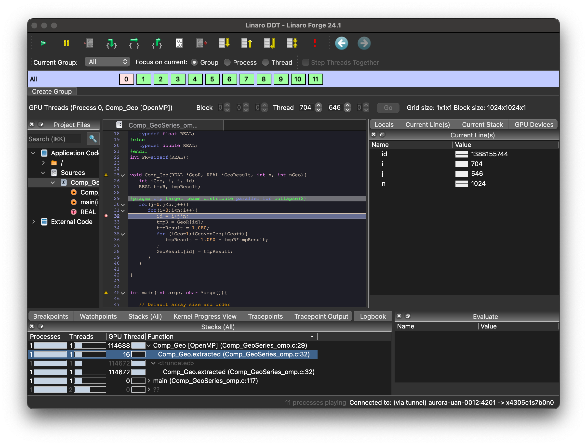

# Debugging on Aurora (WIP)

`gdb-oneapi` from Intel oneAPI software and `ddt` from Linaro are available to debug your applications on Intel Data Center Max 1550 GPUs on Aurora. 

### Users are assumed to know:
* Compilation of codes for Intel Data Center GPU Max cards
* Running the codes on Aurora compute nodes

### Learning Goals:
* How to run `gdb-oneapi` and `ddt` debuggers with your applications on Aurora


## Prelimimaries
To use debuggers, you need to compile and link your application with `-g`. To get anywhere with GPU debugging, the current best practice is to compile and link with `-g -O0`.

Before debugging your applications on Aurora, you must explicitly enable GPU debugging configurations on all the GPUs you are using, on all the nodes you are using. One way to do this is to create a script (`helper_toggle_eu_debug.sh`) and execute it across all your compute nodes using mpiexec. Here is an example script, which takes an argument 1 to enable debugging or 0 to disable it:


```bash 
#!/usr/bin/env bash
# helper_toggle_eu_debug.sh

export MY_RANK=${PMIX_RANK}
export MY_NODE=${PALS_NODEID}
export MY_LOCAL_RANK=${PALS_LOCAL_RANKID}

eu_debug_toggle() {
  for f in /sys/class/drm/card*/prelim_enable_eu_debug
  do
    echo $1 > $f
  done
  echo "INFO: EU debug state on rank-${MY_RANK}: $(cat /sys/class/drm/card*/prelim_enable_eu_debug | tr '\n' ' ')"
  # sleep 10
}

# One rank per node toggles eu debug:
if [ ${MY_LOCAL_RANK} -eq 0 ]; then
    eu_debug_toggle $1
fi
```

On an interactive job mode, issue the following before starting debugging:

```
export NNODES=`wc -l < $PBS_NODEFILE`
mpiexec -n $NNODES ./helper_toggle_eu_debug.sh 1
export ZET_ENABLE_PROGRAM_DEBUGGING=1
```

## Intel gdb-oneapi debugger

#### Loading a module for gdb-oneapi on Aurora
The default `oneapi` module includes `gdb-oneapi`, so no additional module is needed for `gdb-oneapi`.
```
$ module load oneapi 
$ gdb-oneapi --version
GNU gdb (Intel(R) Distribution for GDB* 2024.2.1) 14.2
Copyright (C) 2024 Free Software Foundation, Inc.; (C) 2024 Intel Corp.
License GPLv3+: GNU GPL version 3 or later <http://gnu.org/licenses/gpl.html>
This is free software: you are free to change and redistribute it.
There is NO WARRANTY, to the extent permitted by law.
```

#### Running applications with gdb-oneapi


##### Debugging on a single GPU
```
$ gdb-oneapi -q ./{your_application} 
```


##### Debugging an MPI rank out of multiple MPI ranks
To debug an MPI application with `gdb-oneapi`, xterm can be used to display the output from multiple processes launched in separate xterm windows. For that, X11 forwarding should be established from user's local system to Aurora login node, and then to the compute node. 
```
$ mpirun -n 1 ./{your_application}  : -n 1 xterm -e gdb-oneapi -q ./{your_application} : -n 2 ./{your_application}
```


## Linaro DDT debugger
Linara DDT is widely used for debugging parallel Message Passing Interface (MPI) and threaded applications on HPC systems. Its graphical user interface (GUI) provides a simplifying, easy-to-use method of debugging applications at scale on Aurora. For the best experience, download and install the [Linaro Forge client 24.1.1](https://www.linaroforge.com/download-documentation/). This is available for Linux, macOS, and Windows systems.  


#### Configuring the remote client

Before starting a debugging with DDT on Aurora compute nodes, you need to set your client for remote connection to Aurora. 


Click the `Remote Launch` pull-down and click `Configure` to create a connector for Aurora:


Click the `Add` icon on the `Configure Remote Connections` screen:


Add `Aurora` to `Connection Name`, `<your_user_id>@login.aurora.alcf.anl.gov` to `Host Name`, and `/opt/aurora/24.180.3/support/tools/forge/24.1.1` to `Remote Installation Directory`, and then click `Test Remote Launch` icon to test the configuration.


#### Loading a module for ddt on Aurora
Load the `forge` module on Aurora as follows:  
```
$ module load forge
$ ddt --version
Linaro DDT
Part of Linaro Forge.
Copyright (c) 2023-2024 Linaro Limited. All rights reserved.

Version: 24.1.1
Build ID: e662396d3e3eb309e231c793feaa7dc160ac4093
Review ID: Ifcf4812083c11d6b798d72e0857266c580b59867
Patchset ID: 1
Build Platform: centos linux 7.9 x86_64
Build Date: Dec 17 2024 23:45:12

Frontend OS: Linux
Nodes' OS: unknown
Last connected forge-backend: unknown
```


#### Running applications with ddt and connecting it to your client
Connect the Linaro client on your local system to Aurora by clicking `Aurora` from the `Remote Launch` pull-down:


On an interactive job mode or a bathed job, run `ddt --connect` as follows (e.g., 12 MPI ranks):

```
ddt --np=12 --connect --mpi=generic --mpiargs="--ppn 12 -envall" ./{your_application}

```
On your client, a window with your ddt command pops up for a reverse connection, and clide `Accept` to connect your client to the ddt run on the compute node:


## A quick example

### Start an interactive job mode and activate the debugging mode
```
jkwack@aurora-uan-0012:~> qsub -l select=1 -l walltime=60:00 -A alcf_training -q debug -I -X
qsub: waiting for job 2287553.aurora-pbs-0001.hostmgmt.cm.aurora.alcf.anl.gov to start
qsub: job 2287553.aurora-pbs-0001.hostmgmt.cm.aurora.alcf.anl.gov ready

jkwack@x4711c2s6b0n0:~> cd ALCFBeginnersGuide/aurora/examples/02_tools_example/

jkwack@x4711c2s6b0n0:~/ALCFBeginnersGuide/aurora/examples/02_tools_example> mpiexec -n 1 ./helper_toggle_eu_debug.sh  1
INFO: EU debug state on rank-0: 1 1 1 1 1 1 

jkwack@x4711c2s6b0n0:~/ALCFBeginnersGuide/aurora/examples/02_tools_example> export ZET_ENABLE_PROGRAM_DEBUGGING=1

```


### Build an example
```
jkwack@x4711c2s6b0n0:~/ALCFBeginnersGuide/aurora/examples/02_tools_example> make
mpicc -fiopenmp -fopenmp-targets=spir64   Comp_GeoSeries_omp.c -o Comp_GeoSeries_omp_mpicc_DP 
rm -rf *.o *.mod *.dSYM
mpicc -fiopenmp -fopenmp-targets=spir64  -g -O0  Comp_GeoSeries_omp.c -o Comp_GeoSeries_omp_mpicc_DP_DEBUG 
rm -rf *.o *.mod *.dSYM

jkwack@x4711c2s6b0n0:~/ALCFBeginnersGuide/aurora/examples/02_tools_example> ./Comp_GeoSeries_omp_mpicc_DP_DEBUG 
                     Number of MPI process:      1
                                 Precision: double
      Number of rows/columns of the matrix:   1024
     The highest order of geometric series:     30
                     Number of repetitions:     10
                 Memory Usage per MPI rank:    16.777216 MB
        Warming up .....
        Main Computations  10 repetitions ......
        0%                     25%                      50%                     75%                     100%
        ||||||||||||||||||||||||||||||||||||||||||||||||||||||||||||||||||||||||||||||||||||||||||||||||||||
                      Error_MPI_{Min,Mean,Max}/MPI =   9.5285e-07    9.5285e-07    9.5285e-07
                     GFLOP-rate_{Min,Mean,Max}/MPI =    68.751704     68.751704     68.751704
                                         Wall Time =     0.009151 sec
                                         FLOP-rate =    68.751704 GFLOP/sec

jkwack@x4711c2s6b0n0:~/ALCFBeginnersGuide/aurora/examples/02_tools_example> mpirun -n 12 gpu_tile_compact.sh ./Comp_GeoSeries_omp_mpicc_DP_DEBUG 
                     Number of MPI process:     12
                                 Precision: double
      Number of rows/columns of the matrix:   1024
     The highest order of geometric series:     30
                     Number of repetitions:     10
                 Memory Usage per MPI rank:    16.777216 MB
        Warming up .....
        Main Computations  10 repetitions ......
        0%                     25%                      50%                     75%                     100%
        ||||||||||||||||||||||||||||||||||||||||||||||||||||||||||||||||||||||||||||||||||||||||||||||||||||
                      Error_MPI_{Min,Mean,Max}/MPI =   9.5285e-07    9.5285e-07    9.5285e-07
                     GFLOP-rate_{Min,Mean,Max}/MPI =    34.293652     48.543673     69.819497
                                         Wall Time =     0.018346 sec
                                         FLOP-rate =   411.523820 GFLOP/sec


```


### Debugging with `gdb-oneapi` on a single GPU
```
jkwack@x4711c2s6b0n0:~/ALCFBeginnersGuide/aurora/examples/02_tools_example> gdb-oneapi -q ./Comp_GeoSeries_omp_mpicc_DP_DEBUG 
Reading symbols from ./Comp_GeoSeries_omp_mpicc_DP_DEBUG...
(gdb) break Comp_GeoSeries_omp.c:32
Breakpoint 1 at 0x40378f: file Comp_GeoSeries_omp.c, line 32.
(gdb) run
Starting program: /home/jkwack/ALCFBeginnersGuide/aurora/examples/02_tools_example/Comp_GeoSeries_omp_mpicc_DP_DEBUG 
[Thread debugging using libthread_db enabled]
Using host libthread_db library "/lib64/libthread_db.so.1".
warning: File "/opt/aurora/24.180.3/spack/unified/0.8.0/install/gcc_bootstrap/linux-sles15-x86_64/gcc-7.5.0/gcc-12.2.0-5ieouwtcwrrwan33k5itbqrsrom7cjrh/lib64/libstdc++.so.6.0.30-gdb.py" auto-loading has been declined by your `auto-load safe-path' set to "$datadir/../../../..:/usr".
To enable execution of this file add
    add-auto-load-safe-path /opt/aurora/24.180.3/spack/unified/0.8.0/install/gcc_bootstrap/linux-sles15-x86_64/gcc-7.5.0/gcc-12.2.0-5ieouwtcwrrwan33k5itbqrsrom7cjrh/lib64/libstdc++.so.6.0.30-gdb.py
line to your configuration file "/home/jkwack/.config/gdb/gdbinit".
To completely disable this security protection add
    set auto-load safe-path /
line to your configuration file "/home/jkwack/.config/gdb/gdbinit".
For more information about this security protection see the
"Auto-loading safe path" section in the GDB manual.  E.g., run from the shell:
    info "(gdb)Auto-loading safe path"
[New Thread 0x7fff86c21700 (LWP 128941)]
[New Thread 0x7fff6ffff700 (LWP 128942)]
[Thread 0x7fff86c21700 (LWP 128941) exited]
[New Thread 0x7fff86c21700 (LWP 128943)]
[Thread 0x7fff6ffff700 (LWP 128942) exited]
[Thread 0x7fff86c21700 (LWP 128943) exited]
[New Thread 0x7fff86c21700 (LWP 128944)]
[New Thread 0x7fff6ffff700 (LWP 128945)]
[New Thread 0x7fff57fff700 (LWP 128946)]
[Thread 0x7fff86c21700 (LWP 128944) exited]
[Thread 0x7fff6ffff700 (LWP 128945) exited]
[New Thread 0x7fff6ffff700 (LWP 128947)]
[Thread 0x7fff57fff700 (LWP 128946) exited]
[New Thread 0x7fff57fff700 (LWP 128948)]
[New Thread 0x7fff45b06700 (LWP 128949)]
[Thread 0x7fff6ffff700 (LWP 128947) exited]
[Thread 0x7fff57fff700 (LWP 128948) exited]
[Thread 0x7fff45b06700 (LWP 128949) exited]
[New Thread 0x7fff45b06700 (LWP 128950)]
[New Thread 0x7fff6ffff700 (LWP 128951)]
[New Thread 0x7fff57fff700 (LWP 128952)]
[Thread 0x7fff45b06700 (LWP 128950) exited]
[Thread 0x7fff6ffff700 (LWP 128951) exited]
[Thread 0x7fff57fff700 (LWP 128952) exited]
[New Thread 0x7fff57fff700 (LWP 128953)]
[New Thread 0x7fff6ffff700 (LWP 128954)]
[New Thread 0x7fff45b06700 (LWP 128955)]
[Thread 0x7fff57fff700 (LWP 128953) exited]
[Thread 0x7fff6ffff700 (LWP 128954) exited]
[Thread 0x7fff45b06700 (LWP 128955) exited]
[New Thread 0x7fff45b06700 (LWP 128956)]
[New Thread 0x7fff6ffff700 (LWP 128957)]
[New Thread 0x7fff57fff700 (LWP 128958)]
[Thread 0x7fff45b06700 (LWP 128956) exited]
[Thread 0x7fff6ffff700 (LWP 128957) exited]
[Thread 0x7fff57fff700 (LWP 128958) exited]
intelgt: gdbserver-ze started for process 128938.
[New Thread 0x7fff57fff700 (LWP 129003)]
[New Thread 0x7ffe8d306700 (LWP 129004)]
                     Number of MPI process:      1
                                 Precision: double
      Number of rows/columns of the matrix:   1024
     The highest order of geometric series:     30
                     Number of repetitions:     10
                 Memory Usage per MPI rank:    16.777216 MB
        Warming up .....
[Switching to thread 2.2827:0 (ZE 0.44.1.2 lane 0)]

Thread 2.2827 hit Breakpoint 1.2, with SIMD lanes [0-15], Comp_Geo.extracted () at Comp_GeoSeries_omp.c:32
32           id = i+j*n;
(gdb) list
27     REAL tmpR, tmpResult;
28  
29  #pragma omp target teams distribute parallel for collapse(2)
30     for(j=0;j<n;j++){
31        for(i=0;i<n;i++){
32           id = i+j*n;
33           tmpR = GeoR[id];
34           tmpResult = 1.0E0;
35           for (iGeo=1;iGeo<=nGeo;iGeo++){
36              tmpResult = 1.0E0 + tmpR*tmpResult;
(gdb) set scheduler-locking step
(gdb) step
33           tmpR = GeoR[id];
(gdb) step
34           tmpResult = 1.0E0;
(gdb) step
35           for (iGeo=1;iGeo<=nGeo;iGeo++){
(gdb) step
36              tmpResult = 1.0E0 + tmpR*tmpResult;
(gdb) step
38           GeoResult[id] = tmpResult;
(gdb) print tmpResult
$1 = 1.000990099009901
(gdb) backtrace
#0  Comp_Geo.extracted () at Comp_GeoSeries_omp.c:38
(gdb) exit
A debugging session is active.

    Inferior 1 [process 128938] will be killed.
    Inferior 2 [device [0000:18:00.0].0] will be detached.
    Inferior 3 [device [0000:18:00.0].1] will be detached.
    Inferior 4 [device [0000:42:00.0].0] will be detached.
    Inferior 5 [device [0000:42:00.0].1] will be detached.
    Inferior 6 [device [0000:6c:00.0].0] will be detached.
    Inferior 7 [device [0000:6c:00.0].1] will be detached.
    Inferior 8 [device [0001:18:00.0].0] will be detached.
    Inferior 9 [device [0001:18:00.0].1] will be detached.
    Inferior 10 [device [0001:42:00.0].0] will be detached.
    Inferior 11 [device [0001:42:00.0].1] will be detached.
    Inferior 12 [device [0001:6c:00.0].0] will be detached.
    Inferior 13 [device [0001:6c:00.0].1] will be detached.

Quit anyway? (y or n) y
Detached from device [0000:18:00.0].0
[Inferior 2 (device [0000:18:00.0].0) detached]
Detached from device [0000:18:00.0].1
Ignoring packet error, continuing...
detach: Can't detach process.
[Inferior 3 (device [0000:18:00.0].1) detached]
[Inferior 4 (device [0000:42:00.0].0) detached]
Detached from device [0000:42:00.0].0
Detached from device [0000:42:00.0].1
[Inferior 5 (device [0000:42:00.0].1) detached]
[Inferior 6 (device [0000:6c:00.0].0) detached]
Detached from device [0000:6c:00.0].0
Detached from device [0000:6c:00.0].1
[Inferior 7 (device [0000:6c:00.0].1) detached]
[Inferior 8 (device [0001:18:00.0].0) detached]
Detached from device [0001:18:00.0].0
[Inferior 9 (device [0001:18:00.0].1) detached]
Detached from device [0001:18:00.0].1
[Inferior 10 (device [0001:42:00.0].0) detached]
Detached from device [0001:42:00.0].0
[Inferior 11 (device [0001:42:00.0].1) detached]
Detached from device [0001:42:00.0].1
[Inferior 12 (device [0001:6c:00.0].0) detached]
Detached from device [0001:6c:00.0].0
[Inferior 13 (device [0001:6c:00.0].1) detached]
Detached from device [0001:6c:00.0].1
intelgt: inferior 2 (gdbserver-ze) has been removed.
intelgt: inferior 3 (gdbserver-ze) has been removed.
intelgt: inferior 4 (gdbserver-ze) has been removed.
intelgt: inferior 5 (gdbserver-ze) has been removed.
intelgt: inferior 6 (gdbserver-ze) has been removed.
intelgt: inferior 7 (gdbserver-ze) has been removed.
intelgt: inferior 8 (gdbserver-ze) has been removed.
intelgt: inferior 9 (gdbserver-ze) has been removed.
intelgt: inferior 10 (gdbserver-ze) has been removed.
intelgt: inferior 11 (gdbserver-ze) has been removed.
intelgt: inferior 12 (gdbserver-ze) has been removed.
intelgt: inferior 13 (gdbserver-ze) has been removed.
```

### Debugging an MPI application with `gdb-oneapi`  
X11 forwarding from your local machine to Aurora login node (i.e., ssh -Y login.aurora.alcf.anl.gov) and from the login node to the compute node via an interactive job mode (i.e., qsub -X -I -l select=1 -l walltime=60:00 -A alcf_training -q debug) are required. 
```
jkwack@x4300c2s6b0n0:~/ALCFBeginnersGuide/aurora/examples/02_tools_example> mpirun -n 1 gpu_tile_compact.sh xterm -e gdb-oneapi -q ./Comp_GeoSeries_omp_mpicc_DP_DEBUG : -n 11 gpu_tile_compact.sh ./Comp_GeoSeries_omp_mpicc_DP_DEBUG
```
An xterm window pops for gdb as follows and users can use the same instruction as debugging on a single GPU at the above:


### Debugging with `ddt` 

Load `ddt` module and run `ddt` command with your application:
```
jkwack@x4305c1s7b0n0:~/ALCFBeginnersGuide/aurora/examples/02_tools_example> module load forge

jkwack@x4305c1s7b0n0:~/ALCFBeginnersGuide/aurora/examples/02_tools_example> ddt --np=12 --connect --mpiargs="--ppn 12 -envall" ./Comp_GeoSeries_omp_mpicc_DP_DEBUG
```
A reverser connection request window pops up and you can click `Accept`:

Click `Run`:


Scroll the source window to line 32, and select `Add breakpoint for All` after right-click on the line 32:


Click the green triangle icon on the left top to start debugging:

Click `Pause` on a new window for Processes:

Click `Locals`, `Current Line(s)`, `Current Stack`, or `GPU Devices` to see the data:



## References  
[User Guide for Intel Distribution for GDB](https://www.intel.com/content/www/us/en/docs/distribution-for-gdb/user-guide/2025-0/overview.html)  
[ALCF User Guide for gdb-oneapi](https://docs.alcf.anl.gov/aurora/debugging/gdb-oneapi/)   
[Linaro DDT User Guide](https://docs.linaroforge.com/24.1.1/html/forge/ddt/index.html)   
[ALCF User Guide for Linaro DDT](https://docs.alcf.anl.gov/aurora/debugging/ddt-aurora/)

# [NEXT ->](02_b_profiling.md)
