# Profiling on Aurora (WIP)

On Aurora, several profiling tools from Intel and HPC communities are available to help users profile and optimize their application performance. 
Each tool provides different spectrum of profiling features, and simple examples with the tools are provided in this session.  


### Users are assumed to know:
* Compilation of codes for Intel Data Center GPU Max cards
* Running the codes on Aurora compute nodes

### Learning Goals:
* How to run iprof, VTune, Advisor and APS profilers with your applications on Aurora
* Analyzing results produced on Aurora

## Common part on Aurora
Build your application for Aurora, and then submit your job script to Aurora or start an interactive job mode on Aurora as follows:  
```
$ qsub -I -l select=1 -l walltime=1:00:00 -l filesystems=home -q debug -A <project-name>
```

## Lightweight tracing with iprof/THAPI
THAPI (Tracing Heterogeneous APIs) is a portable, progrmming model-centric tracing framework for heterogeneous computing applications with multiple backends(e.g., OpenCL, L0, and CUDA). `iprof` is a wrapper around the OpenCL, Level Zero, and CUDA tracers, and it provides aggregated profiling information with the minimum overheads. 

#### Loading THAPI module on Aurora
Load the THAPI module on Aurora as follows:  
```
$ module load thapi
$ iprof --version
v0.0.11-106-gf3a65b7
```

#### Instruction to use iprof from the THAPI module 
Run your application with `iprof` on a single GPU.  
```
$ iprof ./{your_application} {Command_line_arguments_for_your_application}
```
Run your application with `iprof` on multiple GPU/Nodes.  
```
$ mpirun -n {Number_of_MPI} -ppn 12 gpu_tile_compact.sh iprof ./{your_application} {Command_line_arguments_for_your_application}
```


<!-- ## Unified tracing and profiling with Intel unitrace  -->


## In-depth profiling with Intel VTune
Intel VTune Profiler provides comprehensive data for application and system performance on Aurora. VTune helps users optimize GPU offload schema and data trasnfers for SYCL or OpenMP offload codes, and identify the most-time consuming GPU kernels for further optimization. It analyzes GPU-bound code for performance bottlenecks caused by microarchitectural contrasints or inefficient kernel algorithms. 

VTune performs kernel-level analyses such as hpc performance characterization, GPU offload analysis and GPU hotspots analysis without rebuilding applications with special flags. For source-level in-kernel profiling analyses (i.e., dynamic instruction count, basic block execution latency, memory latency, hardware-assisted stall sampling, or memory access patterns analysis), the application need to be built with `-fdebug-info-for-profiling -gline-tables-only` which yields less runtime overheads than `-g`.


#### Loading a module for VTune on Aurora
The default `oneapi` module includes VTune, so no additional module is needed for VTune.
```
$ module load oneapi 
$ vtune --version
Intel(R) VTune(TM) Profiler 2024.2.1 (build 628577) Command Line Tool
Copyright (C) 2009 Intel Corporation. All rights reserved.
```

#### Instruction to use VTune 
##### HPC performance characterization

HPC performance characterization analysis (with `-collect hpc-performance`) provide a different aspect of application performance such as high level hardware information, CPU cores utilization, GPU stacks utilization including XVE (Xe Vector Engine) hareware metrics and top offload regions, CPU-side memory metrics, and CPU instruction statics.

```
$ mpirun -n {Number_of_MPI} -ppn 12 gpu_tile_compact.sh vtune -collect hpc-performance -r {result_dir} ./{your_application} {Command_line_arguments_for_your_application}
```
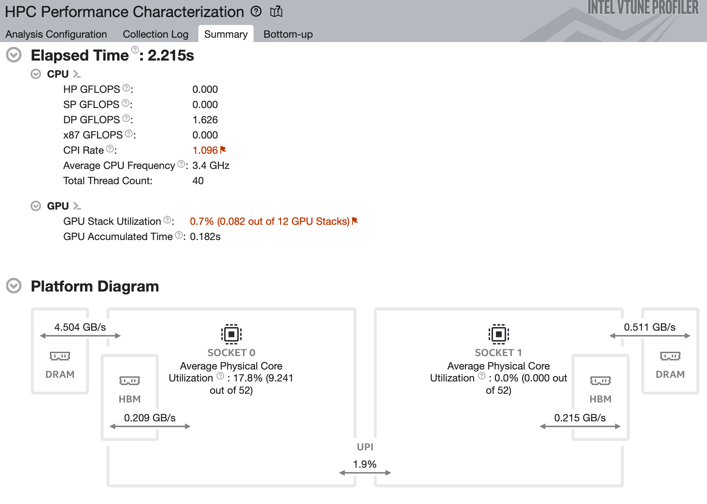
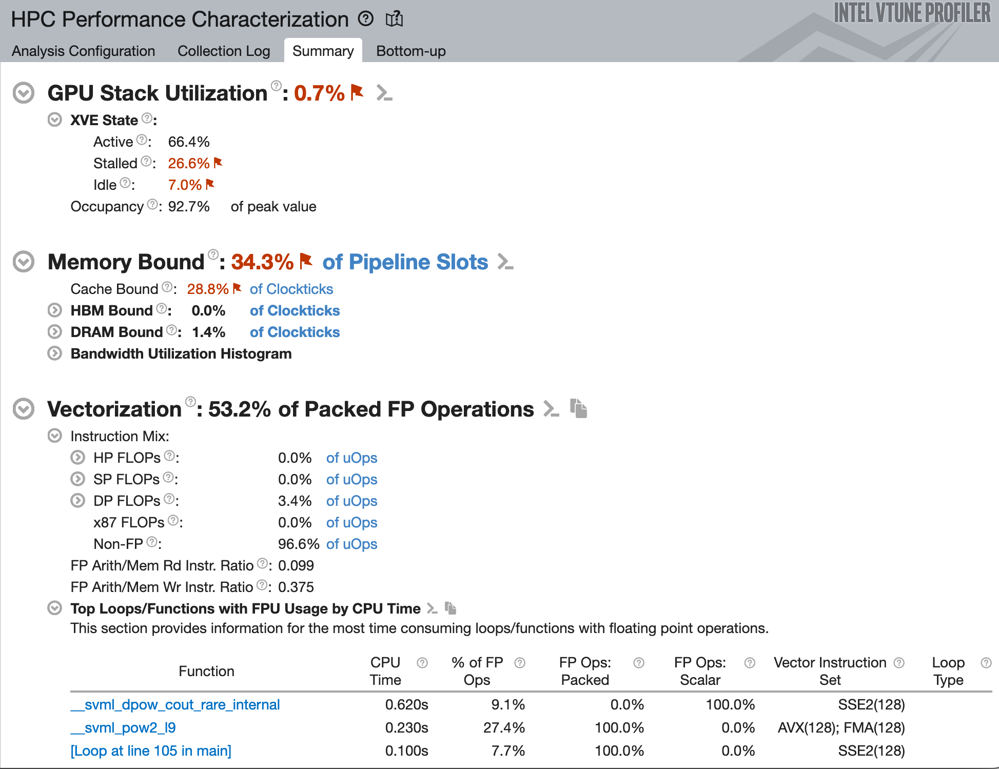

##### GPU offload analysis
GPU offload analysis (with `-collect gpu-offload`) serves studies of an application offload implementation and assesses its efficiency. It traces Level-Zero and OpenCL API functions in oneAPI software stack, detects long latency host functions; shows time spent in data allocation and transfer function as well as kernel device time. 

```
$ mpirun -n {Number_of_MPI} -ppn 12 gpu_tile_compact.sh vtune -collect gpu-offload -r {result_dir} ./{your_application} {Command_line_arguments_for_your_application}
```
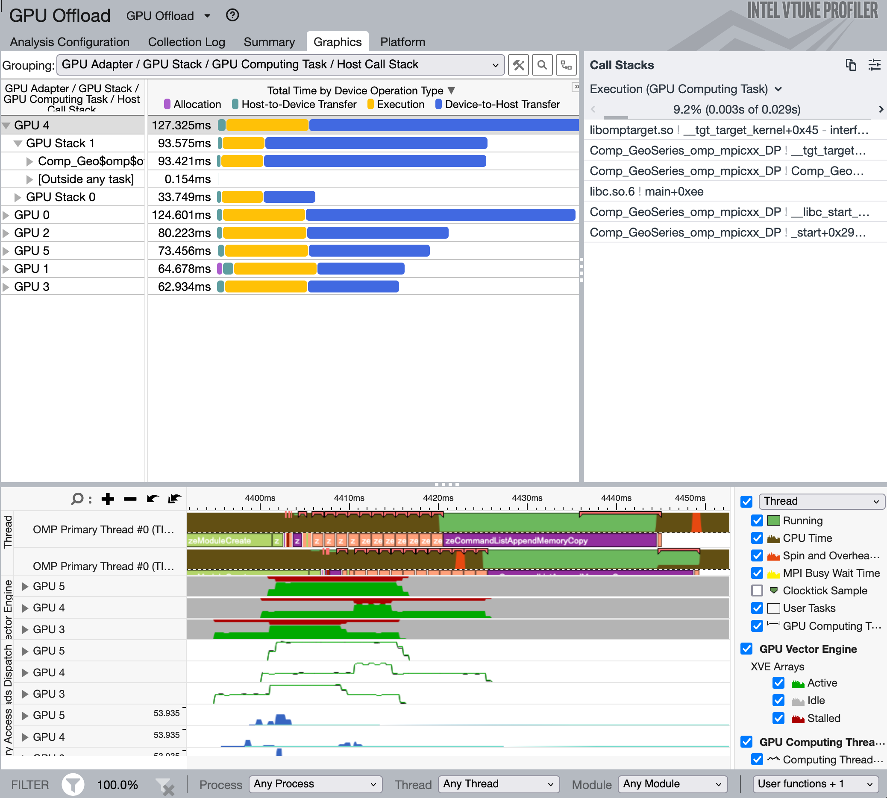


##### GPU compute hotspots analysis
GPU hotspots analysis is the most accurate analysis in tracing kernels on GPU. It allows to analyze the most time-consuming GPU kernels, characterize GPU usage based on GPU hardware metrics, identify performance issues caused by memory latency or inefficient kernel algorithm, and analyze GPU instruction frequency per certain instruction types. 

```
$ mpirun -n {Number_of_MPI} -ppn 12 gpu_tile_compact.sh vtune -collect gpu-hotspots -r {result_dir} ./{your_application} {Command_line_arguments_for_your_application}
```

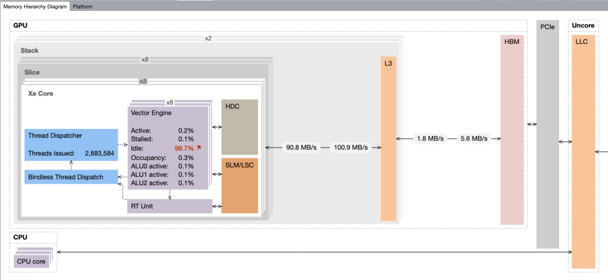
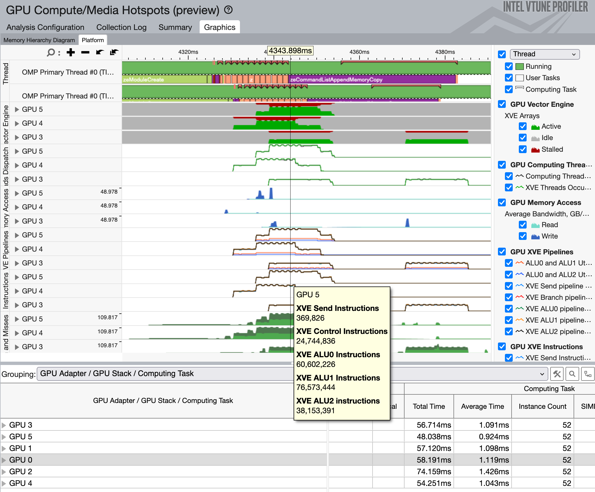

##### Source-level in-kernel profiling analyses

###### VTune instruction count analysis
```
$ mpirun -n {Number_of_MPI} -ppn 12 gpu_tile_compact.sh vtune -collect gpu-hotspots -knob characterization-mode=instruction-count -r {result_dir} ./{your_application} {Command_line_arguments_for_your_application}
```
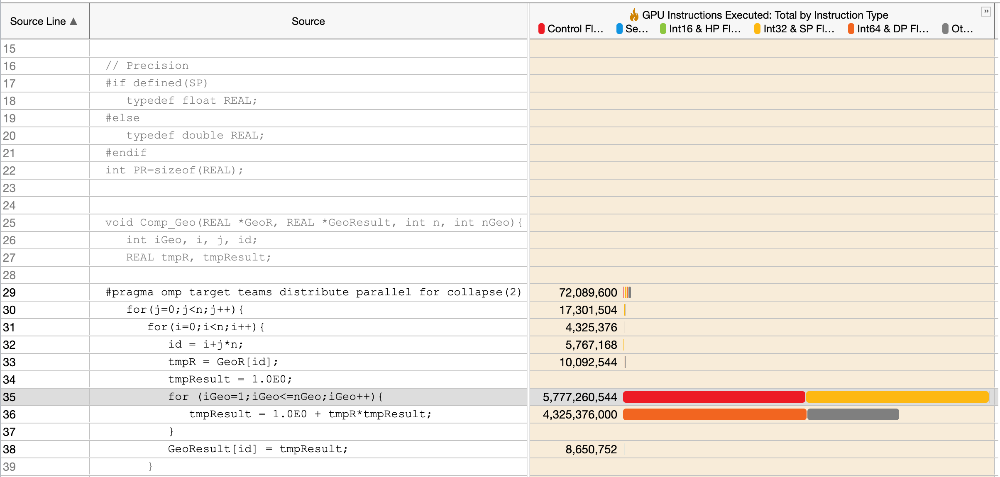

###### VTune source analysis
```
$ mpirun -n {Number_of_MPI} -ppn 12 gpu_tile_compact.sh vtune -collect gpu-hotspots -knob profiling-mode=source-analysis -r {result_dir} ./{your_application} {Command_line_arguments_for_your_application}
```
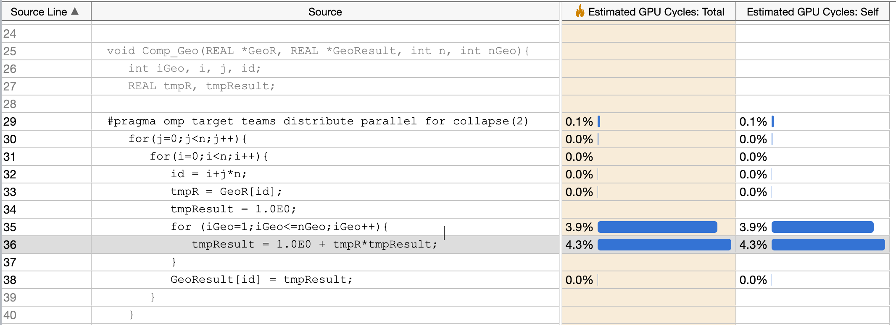


###### VTune memory latency analysis
```
$ mpirun -n {Number_of_MPI} -ppn 12 gpu_tile_compact.sh vtune -collect gpu-hotspots -knob profiling-mode=source-analysis -knob source-analysis=mem-latency -r {result_dir} ./{your_application} {Command_line_arguments_for_your_application}
```
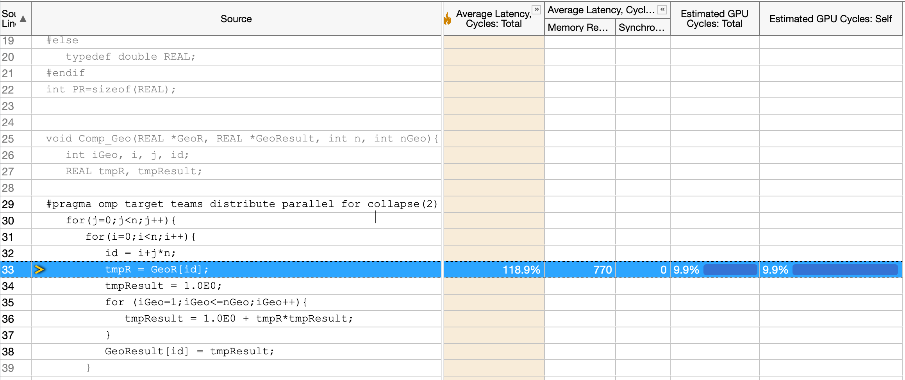


### VTune server for pre-collected results on Aurora via SSH terminal
VTune Profiler in a web server mode is useful to access collected results on Aurora without installing VTune Profiler on every client system. 

#### Instruction to use VTune web server mode

Step 1: Add the following lines to `.ssh/config`  on your local system

```
host *.alcf.anl.gov
  ControlMaster auto
  ControlPath ~/.ssh/ssh_mux_%h_%p_%r
```


Step 2: Open a new terminal and log into an Aurora login node (no X11 forwarding required)

```
$ ssh <username>@login.aurora.alcf.anl.gov
```

Step 3: Start VTune server on an Aurora login node after loading `oneapi` module and setting corresponding environmental variables for VTune

```
$ module load oneapi
$ vtune-backend --data-directory=<location of precollected VTune results>
```
Step 4: Open a new terminal with SSH port forwarding enabled

```
$ ssh -L 127.0.0.1:<port printed by vtune-backend>:127.0.0.1:<port printed by vtune-backend> <username>@login.aurora.alcf.anl.gov
```

<!-- Step 4: Check if the login nodes of Step 2 and Step 3 are the same or not. If not (e.g., aurora-uan-0009 from Step 2 and aurora-uan-0010 from Step 3), do ssh on the terminal for Step 3 to the login node of Step 2

```
$ ssh -L 127.0.0.1:<port printed by vtune-backend>:127.0.0.1:<port printed by vtune-backend> aurora-uan-xxxx
```
 -->
Step 5: Open the URL printed by VTune server in [firefox web browser](https://www.mozilla.org/en-US/firefox/new/) on your local computer. For a security warning, click "Advanced..." and then "Accept the Risk and Continue".

* Accept VTune server certificate: When you open VTune GUI, your web browser will complain about VTune self-signed certificate. You either need to tell web browser to proceed or install VTune server certificate on you client machine so that browser trusts it. To install the certificate note the path to the public part of the certificate printed by VTune server in the output, copy it to you client machine and add to the trusted certificates.

* Set the passphrase: When you run the server for the first time the URL that it outputs contains a one-time-token. When you open such URL in the browser VTune server prompts you to set a passphrase. Other users can't access your VTune server without knowing this passphrase. The hash of the passphase will be persisted on the server. Also, a secure HTTP cookie will be stored in your browser so that you do not need to enter the passphrase each time you open VTune GUI.


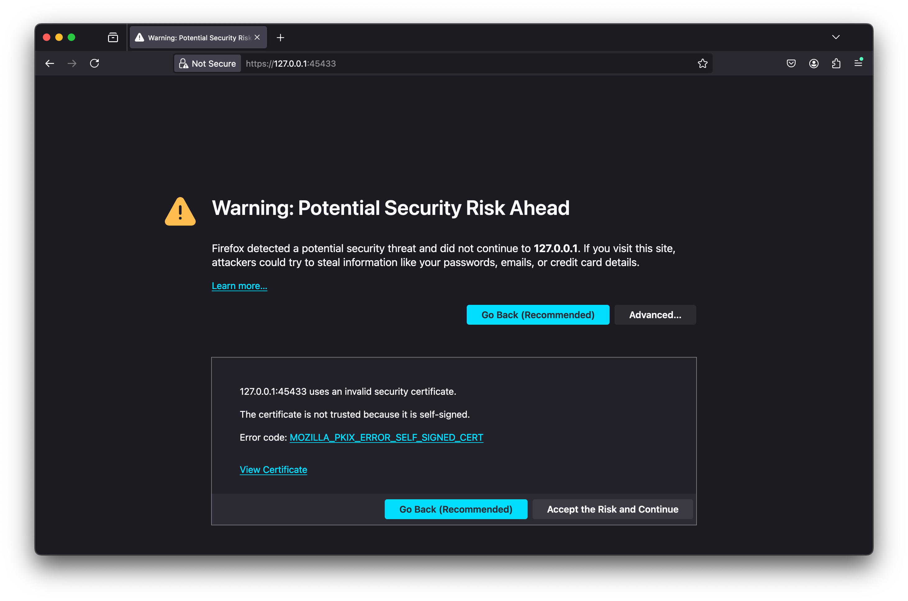
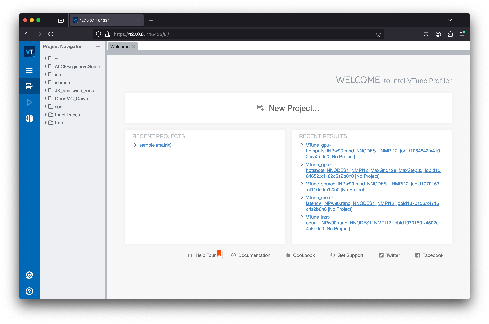


## Kernel-level roofline analyses with Intel Advisor

Intel Advisor is a design and analysis tools for developeing performance code on Aurra. GPU Roofline Insights perspective enables you to estimate and visualize actual performance of GPU kernels using benchmarks and hardware metric profiling against hardware-imposed performance ceilings, as well as determine the main limiting factor.

#### Loading a module for Advisor on Aurora
The default `oneapi` module includes Advisor, so no additional module is needed for Advisor.
```
$ module load oneapi 
$ advisor --version
Intel(R) Advisor 2024.2.1 (build 615624) Command Line Tool
Copyright (C) 2009-2024 Intel Corporation. All rights reserved.
```

#### Instruction to use Advisor roofline features on Aurora

Step1: Setting the environments

```
$ module load oneapi
$ export PRJ=<your_project_dir>
```

Step 2-a: Collecting the GPU Roofline data on a single GPU (Survey analysis and Trip Count with FLOP analysis with a single command line)

```
$ advisor --collect=roofline --profile-gpu --project-dir=$PRJ -- <your_executable> <your_arguments>
```

Step 2-b: Collecting the GPU Roofline data on one of MPI ranks (Survey analysis and Trip Count with FLOP analysis separately)

```
$ mpirun -n 1 gpu_tile_compact.sh advisor --collect=survey --profile-gpu --project-dir=$PRJ -- <your_executable> <your_arguments> : -n 11 gpu_tile_compact.sh <your_executable> <your_arguments>
$ mpirun -n 1 gpu_tile_compact.sh advisor --collect=tripcounts --profile-gpu --flop --no-trip-counts -- project-dir=$PRJ -- <your_executable> <your_arguments> : -n 11 gpu_tile_compact.sh <your_executable> <your_arguments>
```

Step 3: Generate a GPU Roofline report, and then review the HTML report

```
$ advisor --report=all --project-dir=$PRJ --report-output=${PRJ}/roofline_all.html
```
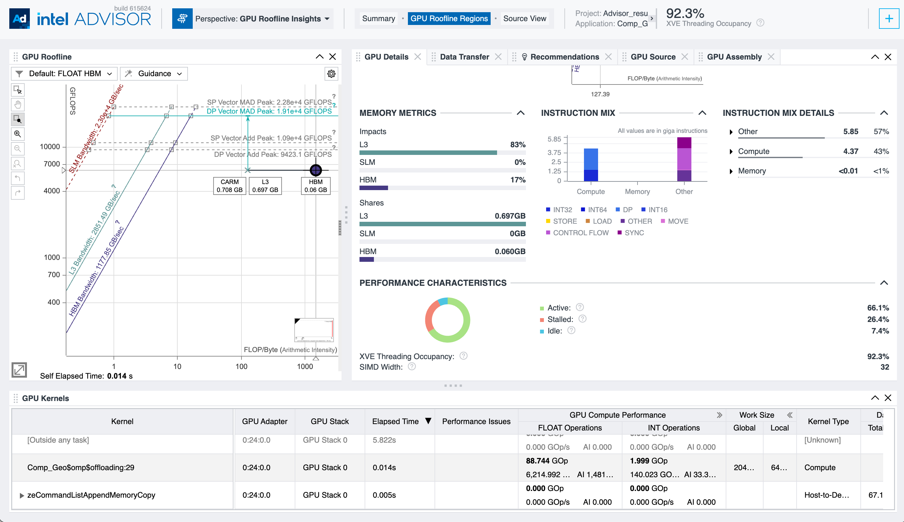


## Profiling at scale with Intel APS
Intel APS (Application Performance Snapshot) provides an aggregated view of application performance at scale, and it is designed for large MPI workloads. 
It captures performance aspects of compute intensive applications such as MPI and OpenMP usage and load imbalace, CPU and GPU utilization, memory access efficiency, vectorization, I/O, and memory footprint. 
APS displays key optimization areas and suggests specialized tools for tuning particular performance aspects, such as Intel VTune Profiler and Intel Advisor. The tool is designed to be used on large MPI workloads and can help analyze different scalability issues on Aurora.


#### Loading a module for APS on Aurora
The default `oneapi` module includes APS, so no additional module is needed for APS.
```
$ module load oneapi 
$ aps --version
Intel(R) VTune(TM) Profiler 2024.2.1 (build 628577) Command Line Tool
Copyright (C) 2009 Intel Corporation. All rights reserved.
```

#### Instruction to use APS
```
$ mpirun -n {Number_of_MPI} -ppn 12 gpu_tile_compact.sh aps -r {aps_result_dir} ./{your_application} {Command_line_arguments_for_your_application}
$ aps-report {aps_result_dir}
```

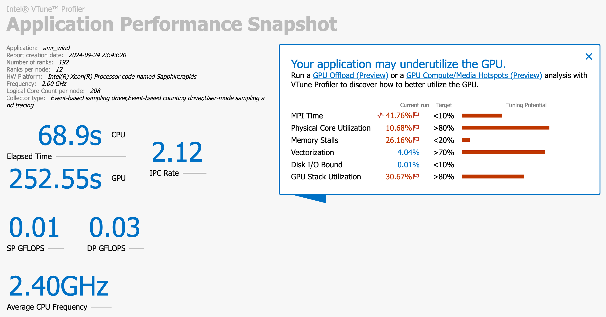
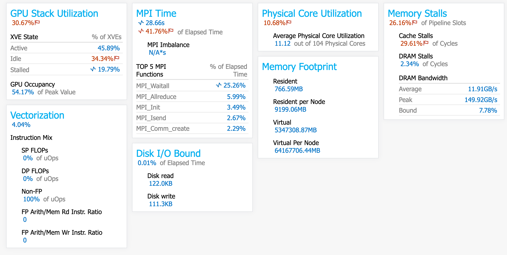

<!-- ## Step-by-step guide -->


--- Need to replace with Aurora example


## A quick example

### Build an example


### iprof


### Intel VTune for kernel-level `gpu-hotspots` analysis

#### Running the example with Intel VTune


#### Reviewing the results with `vtune-backend`


### Intel Advisor for kernel-level roofline analysis

#### Running the example with Intel Advisor


#### Reviewing the results with the stand-alone html file


### Intel APS at scale

#### Running the example with Intel APS


#### Reviewing the results


## References  
[THAPI/iprof github repository](https://github.com/argonne-lcf/THAPI)  
[Intel VTune Profiler User Guide](https://www.intel.com/content/www/us/en/docs/vtune-profiler/user-guide/2025-0/overview.html)   
[ALCF User Guide for VTune](https://docs.alcf.anl.gov/aurora/performance-tools/vtune/)  
[Intel Advisor User Guide](https://www.intel.com/content/www/us/en/docs/advisor/user-guide/2025-0/overview.html)   
[ALCF User Guide for Advisor](https://docs.alcf.anl.gov/aurora/performance-tools/advisor/)   

# [NEXT ->](03_pythonEnvs.md)
