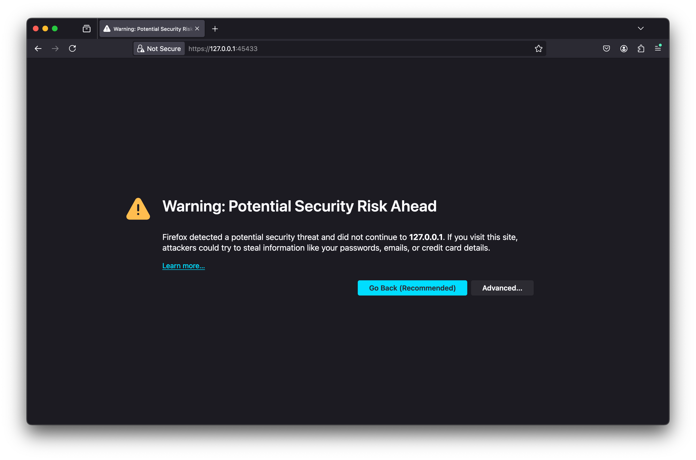

# Profiling on Aurora

On Aurora, several profiling tools from Intel and HPC communities are available to help users profile and optimize their application performance. 
Each tool provides different spectrum of profiling features, and simple examples with the tools are provided in this session.  


### Users are assumed to know:
* Compilation of codes for Intel Data Center GPU Max cards
* Running the codes on Aurora compute nodes

### Learning Goals:
* How to run iprof, VTune, Advisor and APS profilers with your applications on Aurora
* Analyzing results produced on Aurora

## Common part on Aurora
Build your application for Aurora, and then submit your job script to Aurora or start an interactive job mode on Aurora as follows:  
```
$ qsub -I -l select=1 -l walltime=1:00:00 -l filesystems=home -q debug -A <project-name>
```

## Lightweight tracing with iprof/THAPI
THAPI (Tracing Heterogeneous APIs) is a portable, progrmming model-centric tracing framework for heterogeneous computing applications with multiple backends(e.g., OpenCL, L0, and CUDA). `iprof` is a wrapper around the OpenCL, Level Zero, and CUDA tracers, and it provides aggregated profiling information with the minimum overheads. 

#### Loading THAPI module on Aurora
Load the THAPI module on Aurora as follows:  
```
$ module load thapi
$ iprof --version
v0.0.11-106-gf3a65b7
```

#### Instruction to use iprof from the THAPI module 
Run your application with `iprof` on a single GPU.  
```
$ iprof ./{your_application} {Command_line_arguments_for_your_application}
```
Run your application with `iprof` on multiple GPU/Nodes.  
```
$ mpirun -n {Number_of_MPI} -ppn 12 gpu_tile_compact.sh iprof ./{your_application} {Command_line_arguments_for_your_application}
```


<!-- ## Unified tracing and profiling with Intel unitrace  -->


## In-depth profiling with Intel VTune
Intel VTune Profiler provides comprehensive data for application and system performance on Aurora. VTune helps users optimize GPU offload schema and data trasnfers for SYCL or OpenMP offload codes, and identify the most-time consuming GPU kernels for further optimization. It analyzes GPU-bound code for performance bottlenecks caused by microarchitectural contrasints or inefficient kernel algorithms. 

VTune performs kernel-level analyses such as hpc performance characterization, GPU offload analysis and GPU hotspots analysis without rebuilding applications with special flags. For source-level in-kernel profiling analyses (i.e., dynamic instruction count, basic block execution latency, memory latency, hardware-assisted stall sampling, or memory access patterns analysis), the application need to be built with `-fdebug-info-for-profiling -gline-tables-only` which yields less runtime overheads than `-g`.


#### Loading the latest VTune on Aurora

```
$ source /soft/preview/oneapi-lkg/2025.0.0.885_825/oneapi/vtune/2025.0/env/vars.sh
$ vtune --version
Intel(R) VTune(TM) Profiler 2025.0.0 pre-release (build 629072) Command Line Tool
Copyright (C) 2009 Intel Corporation. All rights reserved.
```

#### Instruction to use VTune 
##### HPC performance characterization

HPC performance characterization analysis (with `-collect hpc-performance`) provide a different aspect of application performance such as high level hardware information, CPU cores utilization, GPU stacks utilization including XVE (Xe Vector Engine) hareware metrics and top offload regions, CPU-side memory metrics, and CPU instruction statics.

```
$ mpirun -n {Number_of_MPI} -ppn 12 gpu_tile_compact.sh vtune -collect hpc-performance -r {result_dir} ./{your_application} {Command_line_arguments_for_your_application}
```


##### GPU offload analysis
GPU offload analysis (with `-collect gpu-offload`) serves studies of an application offload implementation and assesses its efficiency. It traces Level-Zero and OpenCL API functions in oneAPI software stack, detects long latency host functions; shows time spent in data allocation and transfer function as well as kernel device time. 

```
$ mpirun -n {Number_of_MPI} -ppn 12 gpu_tile_compact.sh vtune -collect gpu-offload -r {result_dir} ./{your_application} {Command_line_arguments_for_your_application}
```


##### GPU compute hotspots analysis
GPU hotspots analysis is the most accurate analysis in tracing kernels on GPU. It allows to analyze the most time-consuming GPU kernels, characterize GPU usage based on GPU hardware metrics, identify performance issues caused by memory latency or inefficient kernel algorithm, and analyze GPU instruction frequency per certain instruction types. 

```
$ mpirun -n {Number_of_MPI} -ppn 12 gpu_tile_compact.sh vtune -collect gpu-hotspots -r {result_dir} ./{your_application} {Command_line_arguments_for_your_application}
```


##### Source-level in-kernel profiling analyses

###### VTune instruction count analysis
```
$ mpirun -n {Number_of_MPI} -ppn 12 gpu_tile_compact.sh vtune -collect gpu-hotspots -knob characterization-mode=instruction-count -r {result_dir} ./{your_application} {Command_line_arguments_for_your_application}
```


###### VTune source analysis
```
$ mpirun -n {Number_of_MPI} -ppn 12 gpu_tile_compact.sh vtune -collect gpu-hotspots -knob profiling-mode=source-analysis -r {result_dir} ./{your_application} {Command_line_arguments_for_your_application}
```


###### VTune memory latency analysis
```
$ mpirun -n {Number_of_MPI} -ppn 12 gpu_tile_compact.sh vtune -collect gpu-hotspots -knob profiling-mode=source-analysis -knob source-analysis=mem-latency -r {result_dir} ./{your_application} {Command_line_arguments_for_your_application}
```


### VTune server for pre-collected results on Aurora via SSH terminal
VTune Profiler in a web server mode is useful to access collected results on Aurora without installing VTune Profiler on every client system. 

#### Instruction to use VTune web server mode

Step 1: Add the following lines to `.ssh/config`  on your local system

```
host *.alcf.anl.gov
  ControlMaster auto
  ControlPath ~/.ssh/ssh_mux_%h_%p_%r
```


Step 2: Open a new terminal and log into an Aurora login node (no X11 forwarding required)

```
$ ssh <username>@login.aurora.alcf.anl.gov
```

Step 3: Start VTune server on an Aurora login node 

```
$ source /soft/preview/oneapi-lkg/2025.0.0.885_825/oneapi/vtune/2025.0/env/vars.sh
$ vtune-backend --data-directory=<location of precollected VTune results>
```
Step 4: Open a new terminal with SSH port forwarding enabled

```
$ ssh -L 127.0.0.1:<port printed by vtune-backend>:127.0.0.1:<port printed by vtune-backend> <username>@login.aurora.alcf.anl.gov
```

<!-- Step 4: Check if the login nodes of Step 2 and Step 3 are the same or not. If not (e.g., aurora-uan-0009 from Step 2 and aurora-uan-0010 from Step 3), do ssh on the terminal for Step 3 to the login node of Step 2

```
$ ssh -L 127.0.0.1:<port printed by vtune-backend>:127.0.0.1:<port printed by vtune-backend> aurora-uan-xxxx
```
 -->
Step 5: Open the URL printed by VTune server in [firefox web browser](https://www.mozilla.org/en-US/firefox/new/) on your local computer. For a security warning, click "Advanced..." and then "Accept the Risk and Continue".

* Accept VTune server certificate: When you open VTune GUI, your web browser will complain about VTune self-signed certificate. You either need to tell web browser to proceed or install VTune server certificate on you client machine so that browser trusts it. To install the certificate note the path to the public part of the certificate printed by VTune server in the output, copy it to you client machine and add to the trusted certificates.

* Set the passphrase: When you run the server for the first time the URL that it outputs contains a one-time-token. When you open such URL in the browser VTune server prompts you to set a passphrase. Other users can't access your VTune server without knowing this passphrase. The hash of the passphase will be persisted on the server. Also, a secure HTTP cookie will be stored in your browser so that you do not need to enter the passphrase each time you open VTune GUI.





## Kernel-level roofline analyses with Intel Advisor

Intel Advisor is a design and analysis tools for developeing performance code on Aurra. GPU Roofline Insights perspective enables you to estimate and visualize actual performance of GPU kernels using benchmarks and hardware metric profiling against hardware-imposed performance ceilings, as well as determine the main limiting factor.

#### Loading a module for Advisor on Aurora
The default `oneapi` module includes Advisor, so no additional module is needed for Advisor.
```
$ module load oneapi 
$ advisor --version
Intel(R) Advisor 2024.2.1 (build 615624) Command Line Tool
Copyright (C) 2009-2024 Intel Corporation. All rights reserved.
```

#### Instruction to use Advisor roofline features on Aurora

Step1: Setting the environments

```
$ module load oneapi
$ export PRJ=<your_project_dir>
```

Step 2-a: Collecting the GPU Roofline data on a single GPU (Survey analysis and Trip Count with FLOP analysis with a single command line)

```
$ advisor --collect=roofline --profile-gpu --project-dir=$PRJ -- <your_executable> <your_arguments>
```

Step 2-b: Collecting the GPU Roofline data on one of MPI ranks (Survey analysis and Trip Count with FLOP analysis separately)

```
$ mpirun -n 1 gpu_tile_compact.sh advisor --collect=survey --profile-gpu --project-dir=$PRJ -- <your_executable> <your_arguments> : -n 11 gpu_tile_compact.sh <your_executable> <your_arguments>
$ mpirun -n 1 gpu_tile_compact.sh advisor --collect=tripcounts --profile-gpu --flop --no-trip-counts --project-dir=$PRJ -- <your_executable> <your_arguments> : -n 11 gpu_tile_compact.sh <your_executable> <your_arguments>
```

Step 3: Generate a GPU Roofline report, and then review the HTML report

```
$ advisor --report=all --project-dir=$PRJ --report-output=${PRJ}/roofline_all.html
```


## Profiling at scale with Intel APS
Intel APS (Application Performance Snapshot) provides an aggregated view of application performance at scale, and it is designed for large MPI workloads. 
It captures performance aspects of compute intensive applications such as MPI and OpenMP usage and load imbalace, CPU and GPU utilization, memory access efficiency, vectorization, I/O, and memory footprint. 
APS displays key optimization areas and suggests specialized tools for tuning particular performance aspects, such as Intel VTune Profiler and Intel Advisor. The tool is designed to be used on large MPI workloads and can help analyze different scalability issues on Aurora.


#### Loading the latest APS on Aurora
```
$ source /soft/preview/oneapi-lkg/2025.0.0.885_825/oneapi/vtune/2025.0/env/vars.sh
$ aps --version
Intel(R) VTune(TM) Profiler 2025.0.0 pre-release (build 629072) Command Line Tool
Copyright (C) 2009 Intel Corporation. All rights reserved.
```

#### Instruction to use APS
```
$ mpirun -n {Number_of_MPI} -ppn 12 gpu_tile_compact.sh aps -r {aps_result_dir} ./{your_application} {Command_line_arguments_for_your_application}
$ aps-report {aps_result_dir}
```


<!-- ## Step-by-step guide -->


## A quick example

### Start an interactive job mode 
```
jkwack@aurora-uan-0012:~> qsub -l select=1 -l walltime=60:00 -l filesystems=home -A alcf_training -q debug -I
qsub: waiting for job 2287864.aurora-pbs-0001.hostmgmt.cm.aurora.alcf.anl.gov to start
qsub: job 2287864.aurora-pbs-0001.hostmgmt.cm.aurora.alcf.anl.gov ready

jkwack@x4418c7s1b0n0:~> cd ALCFBeginnersGuide/aurora/examples/02_tools_example/
```


### Build an example
```
jkwack@x4418c7s1b0n0:~/ALCFBeginnersGuide/aurora/examples/02_tools_example> make clean
rm -rf *.o *.mod Comp_GeoSeries_omp_mpicc_DP  Comp_GeoSeries_omp_mpicc_DP_DEBUG *.dSYM

jkwack@x4418c7s1b0n0:~/ALCFBeginnersGuide/aurora/examples/02_tools_example> make
mpicc -fiopenmp -fopenmp-targets=spir64  -O2 -fdebug-info-for-profiling -gline-tables-only Comp_GeoSeries_omp.c -o Comp_GeoSeries_omp_mpicc_DP 
rm -rf *.o *.mod *.dSYM
mpicc -fiopenmp -fopenmp-targets=spir64  -g -O0  Comp_GeoSeries_omp.c -o Comp_GeoSeries_omp_mpicc_DP_DEBUG 
rm -rf *.o *.mod *.dSYM

jkwack@x4418c7s1b0n0:~/ALCFBeginnersGuide/aurora/examples/02_tools_example> mpirun -n 12 gpu_tile_compact.sh ./Comp_GeoSeries_omp_mpicc_DP
                     Number of MPI process:     12
                                 Precision: double
      Number of rows/columns of the matrix:   1024
     The highest order of geometric series:     30
                     Number of repetitions:     10
                 Memory Usage per MPI rank:    16.777216 MB
        Warming up .....
        Main Computations  10 repetitions ......
        0%                     25%                      50%                     75%                     100%
        ||||||||||||||||||||||||||||||||||||||||||||||||||||||||||||||||||||||||||||||||||||||||||||||||||||
                      Error_MPI_{Min,Mean,Max}/MPI =   9.5285e-07    9.5285e-07    9.5285e-07
                     GFLOP-rate_{Min,Mean,Max}/MPI =  1198.377796   1971.316234   2392.409707
                                         Wall Time =     0.000525 sec
                                         FLOP-rate = 14380.533551 GFLOP/sec

```


### iprof

```
jkwack@x4418c7s1b0n0:~/ALCFBeginnersGuide/aurora/examples/02_tools_example> module load thapi

jkwack@x4418c7s1b0n0:~/ALCFBeginnersGuide/aurora/examples/02_tools_example> mpirun -n 12 gpu_tile_compact.sh iprof ./Comp_GeoSeries_omp_mpicc_DP
                     Number of MPI process:     12
                                 Precision: double
      Number of rows/columns of the matrix:   1024
     The highest order of geometric series:     30
                     Number of repetitions:     10
                 Memory Usage per MPI rank:    16.777216 MB
        Warming up .....
        Main Computations  10 repetitions ......
        0%                     25%                      50%                     75%                     100%
        ||||||||||||||||||||||||||||||||||||||||||||||||||||||||||||||||||||||||||||||||||||||||||||||||||||
                      Error_MPI_{Min,Mean,Max}/MPI =   9.5285e-07    9.5285e-07    9.5285e-07
                     GFLOP-rate_{Min,Mean,Max}/MPI =  1062.757916   1485.798350   1782.991829
                                         Wall Time =     0.000592 sec
                                         FLOP-rate = 12753.094998 GFLOP/sec
THAPI: Trace location: /home/jkwack/thapi-traces/thapi_aggreg--2025-02-07T00:20:55-06:00
BACKEND_MPI | 1 Hostnames | 12 Processes | 12 Threads | 

         Name |     Time | Time(%) | Calls |  Average |      Min |     Max |         
     MPI_Init |   16.27s |  98.30% |    12 |    1.36s | 371.98ms |   2.41s |         
 MPI_Finalize | 221.80ms |   1.34% |    12 |  18.48ms |  17.15ms | 24.20ms |         
   MPI_Reduce |  59.96ms |   0.36% |    96 | 624.61us |   1.12us |  8.03ms |         
MPI_Comm_rank |  22.89us |   0.00% |    12 |   1.91us |    873ns |  5.60us |         
MPI_Comm_size |  12.02us |   0.00% |    12 |   1.00us |    775ns |  1.32us |         
        Total |   16.55s | 100.00% |   144 |                                         

BACKEND_OMP | 1 Hostnames | 12 Processes | 12 Threads | 

                                 Name |     Time | Time(%) | Calls |  Average |      Min |      Max |         
                ompt_target_exit_data |  71.64ms |  31.94% |    12 |   5.97ms |   4.05ms |   7.21ms |         
ompt_target_data_transfer_from_device |  67.04ms |  29.88% |    12 |   5.59ms |   3.73ms |   6.84ms |         
               ompt_target_enter_data |  29.25ms |  13.04% |    12 |   2.44ms |   1.21ms |   4.15ms |         
  ompt_target_data_transfer_to_device |  26.62ms |  11.87% |    12 |   2.22ms | 916.21us |   3.94ms |         
                          ompt_target |  15.84ms |   7.06% |   132 | 120.01us |  31.65us |   2.60ms |         
               ompt_target_submit_emi |  11.77ms |   5.25% |   132 |  89.15us |   8.43us |   2.53ms |         
               ompt_target_data_alloc |   1.42ms |   0.63% |    24 |  58.97us |  23.26us | 109.23us |         
              ompt_target_data_delete | 755.15us |   0.34% |    24 |  31.46us |   8.79us | 225.82us |         
                                Total | 224.33ms | 100.00% |   360 |                                          

BACKEND_ZE | 1 Hostnames | 12 Processes | 12 Threads | 

                               Name |     Time | Time(%) |  Calls |  Average |      Min |      Max | Error | 
                     zeModuleCreate |    2.87s |  93.09% |    132 |  21.75ms |  94.76us | 237.08ms |     0 | 
      zeCommandListAppendMemoryCopy |  96.89ms |   3.14% |    180 | 538.25us |   9.81us |   6.84ms |     0 | 
                      zeEventCreate |  29.15ms |   0.95% |  49920 | 583.93ns |    243ns |  95.56us |     0 | 
       zeCommandListCreateImmediate |  25.41ms |   0.82% |     24 |   1.06ms |  61.13us |   7.44ms |     0 | 
    zeCommandListAppendLaunchKernel |  10.24ms |   0.33% |    132 |  77.54us |   7.55us |   2.36ms |     0 | 
                    zeModuleDestroy |   8.65ms |   0.28% |    132 |  65.51us |   4.08us | 318.84us |     0 | 
                     zeEventDestroy |   8.39ms |   0.27% |  49920 | 168.12ns |    121ns | 384.99us |     0 | 
             zeEventHostSynchronize |   7.90ms |   0.26% |    312 |  25.34us |    110ns | 509.99us |     0 | 
        zeContextMakeMemoryResident |   7.28ms |   0.24% |     84 |  86.62us |   5.56us | 564.50us |     0 | 
               zeCommandQueueCreate |   3.39ms |   0.11% |     12 | 282.24us | 261.43us | 305.40us |     0 | 
                   zeMemAllocDevice |   3.08ms |   0.10% |     84 |  36.65us |  12.56us | 128.97us |     0 | 
                     zeKernelCreate |   2.23ms |   0.07% |   1752 |   1.27us |    696ns |  73.70us |     0 | 
zeDriverGetExtensionFunctionAddress |   1.86ms |   0.06% |    132 |  15.54us |    300ns | 226.07us |    12 | 
                          zeMemFree |   1.82ms |   0.06% |    108 |  16.89us |   3.50us | 221.87us |     0 | 
                  zeEventPoolCreate |   1.68ms |   0.05% |     36 |  46.53us |  10.15us | 100.63us |     0 | 
                    zeKernelDestroy | 906.35us |   0.03% |   1752 | 517.33ns |    172ns |   8.05us |     0 | 
     zexDriverImportExternalPointer | 905.31us |   0.03% |     12 |  75.44us |  43.19us | 156.18us |     0 | 
                   zeEventHostReset | 665.37us |   0.02% |    312 |   2.13us |   1.02us |  84.96us |     0 | 
                   zeMemAllocShared | 627.74us |   0.02% |     12 |  52.31us |  49.16us |  62.17us |     0 | 
                 zeEventPoolDestroy | 587.22us |   0.02% |     36 |  16.31us |   9.78us |  36.50us |     0 | 
    zexDriverReleaseImportedPointer | 359.69us |   0.01% |     12 |  29.97us |  25.93us |  37.86us |     0 | 
               zeCommandListDestroy | 315.44us |   0.01% |     24 |  13.14us |   6.31us |  19.45us |     0 | 
                     zeMemAllocHost | 231.93us |   0.01% |     12 |  19.33us |  16.90us |  22.15us |     0 | 
           zeModuleGetGlobalPointer | 156.70us |   0.01% |     60 |   2.61us |    193ns | 100.26us |     0 | 
                        zeDeviceGet |  94.84us |   0.00% |     96 | 987.92ns |    320ns |   2.44us |     0 | 
                    zeContextCreate |  82.89us |   0.00% |     48 |   1.73us |   1.16us |   2.29us |     0 | 
                             zeInit |  71.53us |   0.00% |     48 |   1.49us |    350ns |   2.78us |     0 | 
                        zeDriverGet |  48.07us |   0.00% |     84 | 572.24ns |    158ns |   2.66us |     0 | 
               zeKernelSetGroupSize |  37.17us |   0.00% |     15 |   2.48us |    883ns |   3.61us |     0 | 
                   zeContextDestroy |  33.85us |   0.00% |     24 |   1.41us |    873ns |   2.06us |     0 | 
              zeCommandQueueDestroy |  29.19us |   0.00% |     12 |   2.43us |   1.91us |   5.72us |     0 | 
              zeDeviceGetSubDevices |  25.96us |   0.00% |     48 | 540.88ns |    262ns |    802ns |     0 | 
             zeModuleGetKernelNames |  19.49us |   0.00% |     36 | 541.50ns |    204ns |   1.13us |     0 | 
          zeKernelSetIndirectAccess |   8.43us |   0.00% |     12 | 702.75ns |    624ns |    835ns |     0 | 
            zeModuleBuildLogDestroy |   7.46us |   0.00% |     12 | 621.50ns |    480ns |    883ns |     0 | 
              zeDeviceCanAccessPeer |   7.35us |   0.00% |     12 | 612.25ns |    466ns |   1.04us |     0 | 
              zeDriverGetApiVersion |   4.62us |   0.00% |     12 | 385.25ns |    328ns |    497ns |     0 | 
                              Total |    3.08s | 100.00% | 105651 |                                     12 | 

Device profiling | 1 Hostnames | 12 Processes | 12 Threads | 12 Devices | 12 Subdevices | 

                              Name |     Time | Time(%) | Calls |  Average |     Min |     Max |         
zeCommandListAppendMemoryCopy(D2M) |  31.95ms |  70.80% |    12 |   2.66ms |  1.70ms |  4.76ms |         
zeCommandListAppendMemoryCopy(M2D) |  10.36ms |  22.97% |    96 | 107.96us |    80ns |  2.58ms |         
                      Comp_Geo_l29 |   2.59ms |   5.73% |   132 |  19.59us | 18.56us | 27.20us |         
zeCommandListAppendMemoryCopy(S2M) | 200.56us |   0.44% |    48 |   4.18us |  1.36us | 12.56us |         
zeCommandListAppendMemoryCopy(M2M) |  23.60us |   0.05% |    12 |   1.97us |  1.44us |  2.32us |         
zeCommandListAppendMemoryCopy(M2S) |   1.04us |   0.00% |    12 |  86.67ns |    80ns |   160ns |         
                             Total |  45.12ms | 100.00% |   312 |                                        

Explicit memory traffic (BACKEND_MPI) | 1 Hostnames | 12 Processes | 12 Threads | 

      Name | Byte | Byte(%) | Calls | Average | Min | Max |         
MPI_Reduce | 768B | 100.00% |    96 |   8.00B |  8B |  8B |         
     Total | 768B | 100.00% |    96 |                               

Explicit memory traffic (BACKEND_OMP) | 1 Hostnames | 12 Processes | 12 Threads | 

                                 Name |     Byte | Byte(%) | Calls | Average |    Min |    Max |         
               ompt_target_data_alloc | 201.33MB |  50.00% |    24 |  8.39MB | 8.39MB | 8.39MB |         
  ompt_target_data_transfer_to_device | 100.66MB |  25.00% |    12 |  8.39MB | 8.39MB | 8.39MB |         
ompt_target_data_transfer_from_device | 100.66MB |  25.00% |    12 |  8.39MB | 8.39MB | 8.39MB |         
              ompt_target_data_delete |       0B |   0.00% |    24 |   0.00B |     0B |     0B |         
                                Total | 402.65MB | 100.00% |    72 |                                     

Explicit memory traffic (BACKEND_ZE) | 1 Hostnames | 12 Processes | 12 Threads | 

                              Name |     Byte | Byte(%) | Calls | Average |    Min |    Max |         
       zeContextMakeMemoryResident | 241.43MB |  54.52% |    84 |  2.87MB |     8B | 8.39MB |         
zeCommandListAppendMemoryCopy(M2D) | 100.72MB |  22.75% |    96 |  1.05MB |     4B | 8.39MB |         
zeCommandListAppendMemoryCopy(D2M) | 100.66MB |  22.73% |    12 |  8.39MB | 8.39MB | 8.39MB |         
zeCommandListAppendMemoryCopy(S2M) |   2.40kB |   0.00% |    48 |  50.00B |     8B |   144B |         
zeCommandListAppendMemoryCopy(M2S) |     768B |   0.00% |    12 |  64.00B |    64B |    64B |         
zeCommandListAppendMemoryCopy(M2M) |     612B |   0.00% |    12 |  51.00B |    51B |    51B |         
                             Total | 442.82MB | 100.00% |   264 |                                                
```

### Intel VTune for kernel-level `gpu-hotspots` analysis

#### Running the example with Intel VTune
```
jkwack@x4418c7s1b0n0:~/ALCFBeginnersGuide/aurora/examples/02_tools_example> source /soft/preview/oneapi-lkg/2025.0.0.885_825/oneapi/vtune/2025.0/env/vars.sh
jkwack@x4418c7s1b0n0:~/ALCFBeginnersGuide/aurora/examples/02_tools_example> mpirun -n 12 gpu_tile_compact.sh vtune -collect gpu-hotspots -r VTune_result_gpu-hotspots ./Comp_GeoSeries_omp_mpicc_DP
vtune: Analyzing data in the node-wide mode. The hostname (x4418c7s1b0n0) will be added to the result path/name.
vtune: Collection started.
                     Number of MPI process:     12
                                 Precision: double
      Number of rows/columns of the matrix:   1024
     The highest order of geometric series:     30
                     Number of repetitions:     10
                 Memory Usage per MPI rank:    16.777216 MB
        Warming up .....
        Main Computations  10 repetitions ......
        0%                     25%                      50%                     75%                     100%
        ||||||||||||||||||||||||||||||||||||||||||||||||||||||||||||||||||||||||||||||||||||||||||||||||||||
                      Error_MPI_{Min,Mean,Max}/MPI =   9.5285e-07    9.5285e-07    9.5285e-07
                     GFLOP-rate_{Min,Mean,Max}/MPI =   877.269916   1118.208416   1241.217266
                                         Wall Time =     0.000717 sec
                                         FLOP-rate = 10527.238989 GFLOP/sec
vtune: Collection stopped.
vtune: Using result path `/home/jkwack/ALCFBeginnersGuide/aurora/examples/02_tools_example/VTune_result_gpu-hotspots.x4418c7s1b0n0'
vtune: Executing actions 19 % Resolving module symbols                         
vtune: Warning: Cannot locate file `squashfs.ko'.
vtune: Executing actions 19 % Resolving information for `libigc.so.1.0.17537.24
vtune: Warning: Cannot locate debugging information for file `/usr/lib64/libigc.so.1.0.17537.24'.
vtune: Executing actions 19 % Resolving information for `vmlinux'              
vtune: Warning: Cannot locate debugging information for the Linux kernel. Source-level analysis will not be possible. Function-level analysis will be limited to kernel symbol tables. See the Enabling Linux Kernel Analysis topic in the product online help for instructions.
vtune: Warning: Cannot locate file `lnet.ko'.
vtune: Executing actions 19 % Resolving information for `libze_intel_gpu.so.1.5
vtune: Warning: Cannot locate debugging information for file `/usr/lib64/libze_intel_gpu.so.1.5.30872'.
vtune: Executing actions 19 % Resolving information for `libittnotify_collector
vtune: Warning: Cannot locate debugging information for file `/soft/preview/oneapi-lkg/2025.0.0.885_825/oneapi/vtune/2025.0/lib64/runtime/libittnotify_collector.so'.
vtune: Warning: Cannot locate debugging information for file `/soft/preview/oneapi-lkg/2025.0.0.885_825/oneapi/vtune/2025.0/lib64/runtime/libittnotify_collector.so'.
vtune: Executing actions 19 % Resolving information for `libcxi.so.1.5.0'      
vtune: Warning: Cannot locate file `i915.ko'.
vtune: Executing actions 20 % Resolving information for `libc.so.6'            
vtune: Warning: Cannot locate debugging information for file `/lib64/libc.so.6'.
vtune: Executing actions 20 % Resolving information for `libc++abi.so'         
vtune: Warning: Cannot locate file `lustre.ko'.
vtune: Executing actions 20 % Resolving information for `libfabric.so.1.23.1'  
vtune: Warning: Cannot locate file `nfs.ko'.
vtune: Executing actions 20 % Resolving information for `libpthread-2.31.so'   
vtune: Warning: Cannot locate debugging information for file `/lib64/libpthread-2.31.so'.
vtune: Warning: Cannot locate file `sbl.ko'.
vtune: Executing actions 20 % Resolving information for `sbl'                  
vtune: Warning: Cannot locate file `e1000e.ko'.
vtune: Executing actions 20 % Resolving information for `liblzma.so.5.2.3'     
vtune: Warning: Cannot locate debugging information for file `/usr/lib64/liblzma.so.5.2.3'.
vtune: Warning: Cannot locate file `nfsv4.ko'.
vtune: Executing actions 20 % Resolving information for `libdl-2.31.so'        
vtune: Warning: Cannot locate debugging information for file `/lib64/libdl-2.31.so'.
vtune: Executing actions 20 % Resolving information for `libigdgmm.so.12.5.1343
vtune: Warning: Cannot locate debugging information for file `/usr/lib64/libigdgmm.so.12.5.1343'.
vtune: Executing actions 21 % Resolving information for `ld-2.31.so'           
vtune: Warning: Cannot locate debugging information for file `/lib64/ld-2.31.so'.
vtune: Executing actions 21 % Resolving information for `libdwarf.so'          
vtune: Warning: Cannot locate file `lov.ko'.
vtune: Executing actions 21 % Resolving information for `lov'                  
vtune: Warning: Cannot locate file `sunrpc.ko'.
vtune: Executing actions 21 % Resolving information for `sunrpc'               
vtune: Warning: Cannot locate file `drm.ko'.
vtune: Executing actions 21 % Resolving information for `libdaos_common.so'    
vtune: Warning: Cannot locate debugging information for file `/usr/lib64/libdaos_common.so'.
vtune: Executing actions 21 % Resolving information for `libomptarget.rtl.level
vtune: Warning: Cannot locate file `sep5.ko'.
vtune: Executing actions 21 % Resolving information for `libevent_core-2.1.so.6
vtune: Warning: Cannot locate debugging information for file `/usr/lib64/libevent_core-2.1.so.6.0.2'.
vtune: Executing actions 21 % Resolving information for `libtpsstool.so'       
vtune: Warning: Cannot locate debugging information for file `/soft/preview/oneapi-lkg/2025.0.0.885_825/oneapi/vtune/2025.0/lib64/libtpsstool.so'.
vtune: Executing actions 21 % Resolving information for `libpmix.so.2.9.5'     
vtune: Warning: Cannot locate file `cxi_eth.ko'.
vtune: Executing actions 21 % Resolving information for `libc-2.31.so'         
vtune: Warning: Cannot locate debugging information for file `/lib64/libc-2.31.so'.
vtune: Executing actions 22 % Resolving information for `libc-2.31.so'         
vtune: Warning: Cannot locate file `bonding.ko'.
vtune: Executing actions 22 % Resolving information for `libze_intel_gpu.so.1' 
vtune: Warning: Cannot locate debugging information for file `/usr/lib64/libze_intel_gpu.so.1'.
vtune: Executing actions 22 % Resolving information for `libxml2.so.2.9.14'    
vtune: Warning: Cannot locate debugging information for file `/usr/lib64/libxml2.so.2.9.14'.
vtune: Warning: Cannot locate file `cxi_user.ko'.
vtune: Executing actions 22 % Resolving information for `libna_plugin_ofi.so'  
vtune: Warning: Cannot locate debugging information for file `/usr/lib64/mercury/libna_plugin_ofi.so'.
vtune: Warning: Cannot locate file `ptlrpc.ko'.
vtune: Executing actions 22 % Resolving information for `libze_loader.so.1.17.4
vtune: Warning: Cannot locate debugging information for file `/usr/lib64/libze_loader.so.1.17.44'.
vtune: Warning: Cannot locate file `overlay.ko'.
vtune: Executing actions 22 % Resolving information for `libstdc++.so.6'       
vtune: Warning: Cannot locate file `cxi_core.ko'.
vtune: Executing actions 22 % Resolving information for `libmercury.so.2.4.0'  
vtune: Warning: Cannot locate debugging information for file `/usr/lib64/libmercury.so.2.4.0'.
vtune: Executing actions 22 % Resolving information for `libmpi.so.12'         
vtune: Warning: Cannot locate file `obdclass.ko'.
vtune: Executing actions 75 % Generating a report                              Elapsed Time: 7.037s
    GPU Time: 0.014s
Display controller: Intel Corporation Device 0x0bd6 Device Group
    XVE Array Stalled/Idle: 95.6% of Elapsed time with GPU busy
     | The percentage of time when the XVEs were stalled or idle is high, which
     | has a negative impact on compute-bound applications.
     |

        This section shows the XVE metrics per stack and per adapter for all the devices in this group.
        GPU Stack  GPU Adapter  XVE Array Active(%)  XVE Array Stalled(%)  XVE Array Idle(%)
        ---------  -----------  -------------------  --------------------  -----------------
        0          GPU 3                       0.0%                  0.0%             100.0%
        1          GPU 3                       0.0%                  0.0%             100.0%
        0          GPU 5                       0.0%                  0.0%             100.0%
        1          GPU 5                       0.0%                  0.0%             100.0%
        0          GPU 1                       0.0%                  0.0%             100.0%
        1          GPU 1                       0.0%                  0.0%             100.0%
        0          GPU 0                       0.0%                  0.0%             100.0%
        1          GPU 0                       0.0%                  0.0%             100.0%
        0          GPU 2                       0.0%                  0.0%             100.0%
        1          GPU 2                       0.0%                  0.0%             100.0%
        0          GPU 4                       0.0%                  0.0%             100.0%
        1          GPU 4                       0.0%                  0.0%             100.0%
    GPU L3 Bandwidth Bound: 2.9% of peak value
    Occupancy: 6.1% of peak value
     | Several factors including shared local memory, use of memory barriers,
     | and inefficient work scheduling can cause a low value of the occupancy
     | metric.
     |

        This section shows the computing tasks with low occupancy metric for all the devices in this group.
        Computing Task              Total Time  Occupancy(%)  SIMD Utilization(%)
        --------------------------  ----------  ------------  -------------------
        Comp_Geo$omp$offloading:29      0.003s          6.2%                16.7%
Collection and Platform Info
    Application Command Line: ./Comp_GeoSeries_omp_mpicc_DP 
    User Name: jkwack
    Operating System: 5.14.21-150400.24.55-default NAME="SLES" VERSION="15-SP4" VERSION_ID="15.4" PRETTY_NAME="SUSE Linux Enterprise Server 15 SP4" ID="sles" ID_LIKE="suse" ANSI_COLOR="0;32" CPE_NAME="cpe:/o:suse:sles:15:sp4" DOCUMENTATION_URL="https://documentation.suse.com/"
    MPI Process Rank: 11
    Computer Name: x4418c7s1b0n0
    Result Size: 295.7 MB 
    Collection start time: 06:22:29 07/02/2025 UTC
    Collection stop time: 06:22:36 07/02/2025 UTC
    Collector Type: Event-based sampling driver,User-mode sampling and tracing
    CPU
        Name: Intel(R) Xeon(R) Processor code named Sapphirerapids
        Frequency: 2.000 GHz
        Logical CPU Count: 208
        LLC size: 110.1 MB 
    GPU
        GPU 0: 0:24:0.0 : Display controller: Intel Corporation Device 0x0bd6
            BDF: 0:24:0:0
            XVE Count: 448
            Max XVE Thread Count: 8
            Max Core Frequency: 1.600 GHz
        GPU 1: 0:66:0.0 : Display controller: Intel Corporation Device 0x0bd6
            BDF: 0:66:0:0
            XVE Count: 448
            Max XVE Thread Count: 8
            Max Core Frequency: 1.600 GHz
        GPU 2: 0:108:0.0 : Display controller: Intel Corporation Device 0x0bd6
            BDF: 0:108:0:0
            XVE Count: 448
            Max XVE Thread Count: 8
            Max Core Frequency: 1.600 GHz
        GPU 3: 1:24:0.0 : Display controller: Intel Corporation Device 0x0bd6
            BDF: 1:24:0:0
            XVE Count: 448
            Max XVE Thread Count: 8
            Max Core Frequency: 1.600 GHz
        GPU 4: 1:66:0.0 : Display controller: Intel Corporation Device 0x0bd6
            BDF: 1:66:0:0
            XVE Count: 448
            Max XVE Thread Count: 8
            Max Core Frequency: 1.600 GHz
        GPU 5: 1:108:0.0 : Display controller: Intel Corporation Device 0x0bd6
            BDF: 1:108:0:0
            XVE Count: 448
            Max XVE Thread Count: 8
            Max Core Frequency: 1.600 GHz

If you want to skip descriptions of detected performance issues in the report,
enter: vtune -report summary -report-knob show-issues=false -r <my_result_dir>.
Alternatively, you may view the report in the csv format: vtune -report
<report_name> -format=csv.
vtune: Executing actions 100 % done                                            
```

#### Reviewing the results with `vtune-backend`
On a login node, load the latest VTune and then run `vtune-backend`:
```
jkwack@aurora-uan-0012:~> source /soft/preview/oneapi-lkg/2025.0.0.885_825/oneapi/vtune/2025.0/env/vars.sh

jkwack@aurora-uan-0012:~> vtune-backend --data-directory=$PWD
No TLS certificate was provided as a --tls-certificate command-line argument thus a self-signed certificate is generated to enable secure HTTPS transport for the web server: /home/jkwack/.intel/vtune/settings/certificates/middleware.crt. 
VTune Profiler GUI is accessible via https://127.0.0.1:33565/
```
Open a new terminal on your local system, and then establish `ssh -L` connection with the SSH port from `vtune-backend` as follows:
```
jkwack-ALCF-MacM3:~ jkwack$ ssh -L 127.0.0.1:33565:127.0.0.1:33565 jkwack@login.aurora.alcf.anl.gov
Last login: Fri Feb  7 05:50:14 2025 from c-98-220-159-73.hsd1.il.comcast.net

jkwack@aurora-uan-0012:~> 
```
Open a FireFox brower on your local system, and paste the URL from `vtune-backend`. Find the VTune results on `Project Navigator` pane on the left:


Click the result directory on the `Project Navigator` pane:


Click the `Graphics` tab to see `Memory Hierarchy Diagram`:


Click the `Platform` tab:


Zoom-in timeline of interest:


### Intel Advisor for kernel-level roofline analysis

#### Running the example with Intel Advisor
```
jkwack@x4418c7s1b0n0:~/ALCFBeginnersGuide/aurora/examples/02_tools_example> export PRJ=Advisor_result


jkwack@x4418c7s1b0n0:~/ALCFBeginnersGuide/aurora/examples/02_tools_example> mpirun -n 1 gpu_tile_compact.sh advisor --collect=survey --profile-gpu --project-dir=$PRJ -- ./Comp_GeoSeries_omp_mpicc_DP : -n 11 gpu_tile_compact.sh ./Comp_GeoSeries_omp_mpicc_DP
Intel(R) Advisor Command Line Tool
Copyright (C) 2009-2024 Intel Corporation. All rights reserved.
advisor: Collection started.
ZET_ENABLE_API_TRACING_EXP is deprecated. Use ZE_ENABLE_TRACING_LAYER instead
                     Number of MPI process:     12
                                 Precision: double
      Number of rows/columns of the matrix:   1024
     The highest order of geometric series:     30
                     Number of repetitions:     10
                 Memory Usage per MPI rank:    16.777216 MB
        Warming up .....
        Main Computations  10 repetitions ......
        0%                     25%                      50%                     75%                     100%
        ||||||||||||||||||||||||||||||||||||||||||||||||||||||||||||||||||||||||||||||||||||||||||||||||||||
                      Error_MPI_{Min,Mean,Max}/MPI =   9.5285e-07    9.5285e-07    9.5285e-07
                     GFLOP-rate_{Min,Mean,Max}/MPI =   617.414110   1947.791435   2331.120059
                                         Wall Time =     0.001019 sec
                                         FLOP-rate =  7408.969321 GFLOP/sec
advisor: Error: Cannot stop collection of GPU events
advisor: Collection stopped.
advisor: Opening result 30 % Resolving information for `libfabric.so.1'        
advisor: Warning: Cannot locate file `[stack]'.
advisor: Opening result 30 % Resolving information for `ld-linux-x86-64.so.2'  
advisor: Warning: Cannot locate debugging information for file `/lib64/ld-linux-x86-64.so.2'.
advisor: Opening result 31 % Resolving information for `libdl.so.2'            
advisor: Warning: Cannot locate debugging information for file `/lib64/libdl.so.2'.
advisor: Opening result 31 % Resolving information for `libze_intel_gpu.so.1'  
advisor: Warning: Cannot locate debugging information for file `/usr/lib64/libze_intel_gpu.so.1'.
advisor: Opening result 32 % Resolving information for `libze_loader.so.1'     
advisor: Warning: Cannot locate debugging information for file `/usr/lib64/libze_loader.so.1'.
advisor: Opening result 32 % Resolving information for `libpthread.so.0'       
advisor: Warning: Cannot locate debugging information for file `/lib64/libpthread.so.0'.
advisor: Opening result 32 % Resolving information for `libc.so.6'             
advisor: Warning: Cannot locate debugging information for file `/lib64/libc.so.6'.
advisor: Opening result 32 % Resolving information for `libze_tracing_layer.so.
advisor: Warning: Cannot locate debugging information for file `/usr/lib64/libze_tracing_layer.so.1'.
advisor: Opening result 33 % Resolving information for `libigc.so.1'           
advisor: Warning: Cannot locate debugging information for file `/usr/lib64/libigc.so.1'.
advisor: Opening result 33 % Resolving information for `libittnotify_collector.
advisor: Warning: Cannot locate debugging information for file `/opt/aurora/24.180.3/oneapi/advisor/2024.2/lib64/runtime/libittnotify_collector.so'.
advisor: Opening result 34 % Resolving information for `libtpsstool.so'        
advisor: Warning: Cannot locate debugging information for file `/opt/aurora/24.180.3/oneapi/advisor/2024.2/lib64/libtpsstool.so'.
advisor: Opening result 99 % done                                              
advisor: Preparing frequently used data  0 % done                              
advisor: Preparing frequently used data 100 % done                             
advisor: Warning: Higher instruction set architecture (ISA) available 
advisor: Warning: Too small execution time on GPU 

Program Elapsed Time: 3.68s

CPU Time: 3.68s
Time in 1 Vectorized Loop: 0.01s

GPU Time: < 0.01s
Data Transfer Time: < 0.01s
XVE Array Active / Stalled / Idle: 11.8% / 5.1% / 83.2%

Top GPU Hotspots:
MPI rank:0

           Kernel                Time    Calls   Active   Stalled    Idle    EU Occupancy   Threads Started   
______________________________________________________________________________________________________________
Comp_Geo$omp$offloading:29      0.000s      11    11.8%      5.1%    83.2%          15.3%           207,360   

advisor: The report is saved in '/home/jkwack/ALCFBeginnersGuide/aurora/examples/02_tools_example/Advisor_result/rank.0/hs000/advisor-survey.txt'.


jkwack@x4418c7s1b0n0:~/ALCFBeginnersGuide/aurora/examples/02_tools_example> mpirun -n 1 gpu_tile_compact.sh advisor --collect=tripcounts --profile-gpu --flop --no-trip-counts --project-dir=$PRJ -- ./Comp_GeoSeries_omp_mpicc_DP : -n 11 gpu_tile_compact.sh ./Comp_GeoSeries_omp_mpicc_DP
Intel(R) Advisor Command Line Tool
Copyright (C) 2009-2024 Intel Corporation. All rights reserved.
advisor: Opening result 25 % done                                              
advisor: Preparing frequently used data  0 % done                              
advisor: Opening result 25 % done                                              
advisor: Preparing frequently used data  0 % done                              
advisor: Preparing frequently used data 100 % done                             
advisor: Collection started.
ZET_ENABLE_API_TRACING_EXP is deprecated. Use ZE_ENABLE_TRACING_LAYER instead
                     Number of MPI process:     12
                                 Precision: double
      Number of rows/columns of the matrix:   1024
     The highest order of geometric series:     30
                     Number of repetitions:     10
                 Memory Usage per MPI rank:    16.777216 MB
        Warming up .....
        Main Computations  10 repetitions ......
        0%                     25%                      50%                     75%                     100%
        ||||||||||||||||||||||||||||||||||||||||||||||||||||||||||||||||||||||||||||||||||||||||||||||||||||
                      Error_MPI_{Min,Mean,Max}/MPI =   9.5285e-07    9.5285e-07    9.5285e-07
                     GFLOP-rate_{Min,Mean,Max}/MPI =     5.782262   1794.702088   2312.732609
                                         Wall Time =     0.108806 sec
                                         FLOP-rate =    69.387147 GFLOP/sec
advisor: Opening result 99 % done                                              
advisor: Preparing frequently used data  0 % done                              
advisor: Preparing frequently used data 100 % done                             
advisor: Warning: Higher instruction set architecture (ISA) available 
advisor: Warning: Too small execution time on GPU 

Program Elapsed Time: 3.68s

CPU Time: 3.68s
Time in 1 Vectorized Loop: 0.01s
GFLOPS: 0.00
GINTOPS: 0.00

GPU Time: < 0.01s
Data Transfer Time: < 0.01s
XVE Array Active / Stalled / Idle: 11.8% / 5.1% / 83.2%

Top GPU Hotspots:
MPI rank:0

           Kernel                Time     GFLOPS     GINTOPS   Calls   Active   Stalled    Idle    EU Occupancy   Threads Started   
____________________________________________________________________________________________________________________________________
Comp_Geo$omp$offloading:29      0.000s   3,103.040   702.923      11    11.8%      5.1%    83.2%          15.3%           207,360   

advisor: The report is saved in '/home/jkwack/ALCFBeginnersGuide/aurora/examples/02_tools_example/Advisor_result/rank.0/trc000/advisor-survey.txt'.


jkwack@x4418c7s1b0n0:~/ALCFBeginnersGuide/aurora/examples/02_tools_example> advisor --report=all --project-dir=$PRJ --report-output=${PRJ}/roofline_all.html
advisor: Opening result 25 % done                                              
advisor: Preparing frequently used data  0 % done                              
advisor: Issues progress 33 % done                                             
advisor: Issues progress  0 % done                       
```

#### Reviewing the results with the stand-alone html file

Download `roofline_all.html` from the Advisor result folder on Aurora to your local system, and then open it with a web-browser:


Click the `GPU Roofline Regions` tab to see more details for GPU roofline data:


Select `CARM`, `L3`, and `HBM` in `Default: FLOAT HBM` tab to activate hierarchical roofline data:


Double-click roofline dots in the graph to see the performance bottleneck:


### Intel APS at scale

#### Running the example with Intel APS
```
jkwack@x4418c7s1b0n0:~/ALCFBeginnersGuide/aurora/examples/02_tools_example> mpirun -n 12 gpu_tile_compact.sh aps -r APS_result ./Comp_GeoSeries_omp_mpicc_DP
                     Number of MPI process:     12
                                 Precision: double
      Number of rows/columns of the matrix:   1024
     The highest order of geometric series:     30
                     Number of repetitions:     10
                 Memory Usage per MPI rank:    16.777216 MB
        Warming up .....
        Main Computations  10 repetitions ......
        0%                     25%                      50%                     75%                     100%
        ||||||||||||||||||||||||||||||||||||||||||||||||||||||||||||||||||||||||||||||||||||||||||||||||||||
                      Error_MPI_{Min,Mean,Max}/MPI =   9.5285e-07    9.5285e-07    9.5285e-07
                     GFLOP-rate_{Min,Mean,Max}/MPI =  1289.119642   1939.139763   2312.732609
                                         Wall Time =     0.000488 sec
                                         FLOP-rate = 15469.435701 GFLOP/sec
Intel(R) VTune(TM) Profiler 2025.0.0 collection completed successfully. Use the "aps --report /home/jkwack/ALCFBeginnersGuide/aurora/examples/02_tools_example/APS_result" command to generate textual and HTML reports for the profiling session.


jkwack@x4418c7s1b0n0:~/ALCFBeginnersGuide/aurora/examples/02_tools_example> aps --report APS_result
| Summary information
|--------------------------------------------------------------------
  Application                   : Comp_GeoSeries_omp_mpicc_DP
  Report creation date          : 2025-02-07 00:59:43
  Number of ranks               : 12
  Ranks per node                : 12
  OpenMP threads number per Rank: 1
  HW Platform                   : Intel(R) Xeon(R) Processor code named Sapphirerapids
  Frequency                     : 2.00 GHz
  Logical core count per node   : 208
  Collector type                : Event-based sampling driver,Event-based counting driver,User-mode sampling and tracing
  Used statistics               : APS_result
|
| Your application might underutilize the available logical CPU cores
| because of insufficient parallel work, blocking on synchronization, or too much I/O. Perform function or source line-level profiling with tools like Intel(R) VTune(TM) Profiler to discover why the CPU is underutilized.
|
  Elapsed Time:                               1.82 s
  SP GFLOPS:                                  0.02
  DP GFLOPS:                                  0.55
  Average CPU Frequency:                      2.40 GHz
  IPC Rate:                                   1.23
  GPU Accumulated Time:                       0.01 s
  MPI Time:                                   1.29 s            70.76% of Elapsed Time
| Your application is MPI bound. This may be caused by high busy wait time
| inside the library (imbalance), non-optimal communication schema or MPI
| library settings. Explore the MPI Imbalance metric if it is available or use
| MPI profiling tools like Intel(R) Trace Analyzer and Collector to explore
| possible performance bottlenecks.
| Some of the individual values contributing to this average metric are
| statistical outliers that can significantly distort the average metric value.
| They can also be a cause of performance degradation.
| Please use --counters or --metrics="MPI Time" reports for details.
    MPI Imbalance:                            N/A*
| * No information about MPI Imbalance time is available. Set APS_IMBALANCE_TYPE
| to 1 or 2 to collect it.
    Top 5 MPI functions (avg time):
        MPI_Init:                             1.20 s            66.10% of Elapsed Time
        MPI_Reduce:                           0.08 s             4.33% of Elapsed Time
| Some of the individual values contributing to this average metric are
| statistical outliers that can significantly distort the average metric value.
| They can also be a cause of performance degradation.
| Please use --counters or --metrics="MPI Hotspot 2 - MPI_Reduce" reports for
| details.
        MPI_Finalize:                         0.01 s             0.33% of Elapsed Time
| Some of the individual values contributing to this average metric are
| statistical outliers that can significantly distort the average metric value.
| They can also be a cause of performance degradation.
| Please use --counters or --metrics="MPI Hotspot 3 - MPI_Finalize" reports for
| details.
        MPI_Comm_rank:                        0.00 s             0.00% of Elapsed Time
        MPI_Comm_size:                        0.00 s             0.00% of Elapsed Time
| Some of the individual values contributing to this average metric are
| statistical outliers that can significantly distort the average metric value.
| They can also be a cause of performance degradation.
| Please use --counters or --metrics="MPI Hotspot 5 - MPI_Comm_size" reports for
| details.
  Physical Core Utilization:                  8.30%
| The metric is below 80% threshold, which may signal a poor physical CPU cores
| utilization caused by: load imbalance, threading runtime overhead, contended
| synchronization, insufficient parallelism, incorrect affinity that utilizes
| logical cores instead of physical cores. Perform threading analysis with tools
| like Intel(R) VTune(TM) Profiler to discover why physical cores are
| underutilized.
  Average Physical Core Utilization:          8.60 out of 104 Physical Cores
  GPU Stack Utilization:                      0.00%
| The percentage of time when the XVEs were stalled or idle is high, which has a
| negative impact on compute-bound applications.
    XVE State:
       Active:                               19.50%
       Stalled:                               9.00%
       Idle:                                 71.50%
| A significant portion of GPU time is spent idle. This is usually caused by
| imbalance or thread scheduling problems.
    Offload Activity:
       Compute:                               0.00%
       Data Transfer:                         0.00%
       Overhead:                            100.00%
| A significant portion of GPU offload time is spent in overhead related parts.
  GPU Occupancy:                             25.90% of Peak Value
| Low value of the occupancy metric may be caused by inefficient work
| scheduling. Make sure work items are neither too small nor too large.
  Memory Stalls:                             31.90% of Pipeline Slots
| The metric value can indicate that a significant fraction of execution
| pipeline slots could be stalled due to demand memory load and stores. See the
| second level metrics to define if the application is cache- or DRAM-bound and
| the NUMA efficiency. Use Intel(R) VTune(TM) Profiler Memory Access analysis to
| review a detailed metric breakdown by memory hierarchy, memory bandwidth
| information, and correlation by memory objects.
    Cache Stalls:                            29.90% of Cycles
| A significant proportion of cycles are spent on data fetches from cache. Use
| Intel(R) VTune(TM) Profiler Memory Access analysis to see if accesses to L2 or
| L3 cache are problematic and consider applying the same performance tuning as
| you would for a cache-missing workload. This may include reducing the data
| working set size, improving data access locality, blocking or partitioning the
| working set to fit in the lower cache levels, or exploiting hardware
| prefetchers.
    DRAM Stalls:                              2.00% of Cycles
    DRAM Bandwidth
       Peak:                                  6.26 GB/s
       Average:                               1.38 GB/s
       Bound:                                 0.00%
  Vectorization:                            100.00%
     Instruction Mix:
       SP FLOPs:                              0.00% of uOps
       DP FLOPs:                              1.10% of uOps
          Packed:                           100.00% from DP FP
             128-bit:                       100.00%
| A significant fraction of floating point arithmetic vector instructions
| executed with partial vector load. A possible reason is compilation with a
| legacy instruction set. Check the compiler options. Another possible reason is
| compiler code generation specifics. Use Intel(R) Advisor to learn more.
             256-bit:                         0.00%
             512-bit:                         0.00%
          Scalar:                             0.00% from DP FP
       Non-FP:                               98.80% of uOps
     FP Arith/Mem Rd Instr. Ratio:            0.04
| The metric value might indicate unaligned access to data for vector
| operations. Use Intel(R) Advisor to find possible data access inefficiencies
| for vector operations.
     FP Arith/Mem Wr Instr. Ratio:            0.08
| The metric value might indicate unaligned access to data for vector
| operations. Use Intel(R) Advisor to find possible data access inefficiencies
| for vector operations.
 Average PCI Bandwidth:
   Average PCIe Bandwidth Usage by GPU:
     Inbound PCIe Read:                       0.80 MB/s
     Inbound PCIe Write:                      4.97 MB/s
   Average PCIe Bandwidth Usage by Network Controller Devices:
     Inbound PCIe Read:                       0.03 MB/s
     Inbound PCIe Write:                      0.00 MB/s
 Disk I/O Bound:                              0.00 s             0.05% of Elapsed Time
      Disk read:                              11.9 KB
      Disk write:                              6.1 KB
 Memory Footprint:
 Resident:
       Per node:
           Peak resident set size    :         5297.00 MB (node x4418c7s1b0n0)
           Average resident set size :         5297.00 MB
       Per rank:
           Peak resident set size    :          444.00 MB (rank 9)
           Average resident set size :          441.42 MB
 Virtual:
       Per node:
           Peak memory consumption    :     63553535.00 MB (node x4418c7s1b0n0)
           Average memory consumption :     63553535.00 MB
       Per rank:
           Peak memory consumption    :      5296128.00 MB (rank 11)
           Average memory consumption :      5296127.92 MB

Graphical representation of this data is available in the HTML report: /home/jkwack/ALCFBeginnersGuide/aurora/examples/02_tools_example/aps_report_20250207_010006.html

```

#### Reviewing the results
Download the html file produced by APS to your local system and then open it with a web-browser:


See more details using tool tips:


## References  
[THAPI/iprof github repository](https://github.com/argonne-lcf/THAPI)  
[Intel VTune Profiler User Guide](https://www.intel.com/content/www/us/en/docs/vtune-profiler/user-guide/2025-0/overview.html)   
[ALCF User Guide for VTune](https://docs.alcf.anl.gov/aurora/performance-tools/vtune/)  
[Intel Advisor User Guide](https://www.intel.com/content/www/us/en/docs/advisor/user-guide/2025-0/overview.html)   
[ALCF User Guide for Advisor](https://docs.alcf.anl.gov/aurora/performance-tools/advisor/)   

# [NEXT ->](03_pythonEnvs.md)
