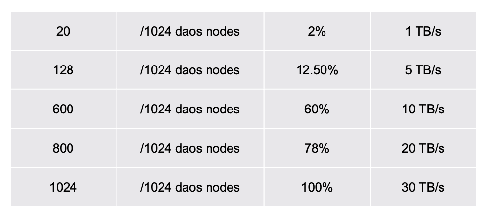
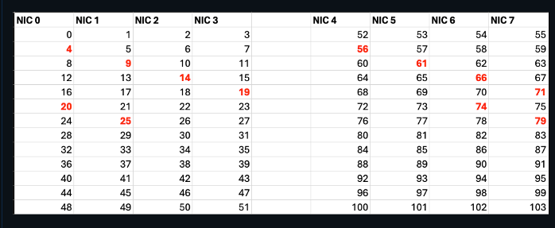

# DAOS - Distributed Asycnhronous Object Store File System

## Introduction

DAOS is a major file system in Aurora with 230 PB delivering upto >30 TB/s with 1024 DAOS server storage Nodes. DAOS is an open-source software-defined object store designed for massively distributed Non Volatile Memory (NVM) and NVMe SSD. DAOS presents a unified storage model with a native Key-array Value storage interface supporitng POSIX, MPIO, DFS and HDF5. Users can use DAOS for their I/O and checkpointing on Aurora. DAOS is fully integrated with the wider Aurora compute fabric as can be seen in the overall storage architecture below.

## Why you need to use DAOS instead of Lustre

* Efficient for unstructured data.
* Efficient for accessing small data.
* Compared to Lustre's 0.6 TB/s, our current daos_user cluster with 128 / 1024 daos can deliver 5 TB/s.

DAOS cluster size is the number of available DAOS servers. While we are working towards bringing up the entire 1024 DAOS server available users, currently different number of DAOS nodes could be up. Please check with support or run an IOR test to get an estimate on the current number of DAOS servers available. The bandwidth listed here in the last column is a theoretical peak bandwidth.



## Note

This is an initial test DAOS configuration and as such, any data on the DAOS system will eventually be deleted when the configuration is changed into a larger system. Warning will be given before the system is wiped to allow time for users to move any important data off.

DAOS is a scratch file system. Please note that data may be removed or unavailable at any time.

## DAOS Pool Allocation

The first step in using DAOS is to get DAOS POOL space allocated for your project. Users should submit a request as noted below to have a DAOS pool created for your project.

DAOS pool is a physically allocated dedicated storage space for your project.

Email [support@alcf.anl.gov](mailto:support@alcf.anl.gov) to request a DAOS pool with the following information.

* Project Name
* ALCF User Names
* Total Space requested (typically 100 TBs++)
* Justification
* Preferred pool name

## Modules

Please load the `daos` module when using DAOS. This should be done on the login node (UAN) or in the compute node (jobscript):

```
module use /soft/modulefiles
module load daos
```

## Pool

Pool is a dedicated space allocated to your project. Once your pool is allocated for your project space.

Confirm you are able to query the pool via:

```
daos pool query <pool_name>
```

**Example output:**

```
daos pool query hacc
Pool 050b20a3-3fcc-499b-a6cf-07d4b80b04fd, ntarget=640, disabled=0, leader=2, version=131
Pool space info:
- Target(VOS) count:640
- Storage tier 0 (SCM):
Total size: 6.0 TB
  Free: 4.4 TB, min:6.5 GB, max:7.0 GB, mean:6.9 GB
- Storage tier 1 (NVMe):
  Total size: 200 TB
  Free: 194 TB, min:244 GB, max:308 GB, mean:303 GB
Rebuild done, 4 objs, 0 recs
```

## DAOS Container

The container is the basic unit of storage. A POSIX container can contain hundreds of millions of files, you can use it to store all of your data. You only need a small set of containers; perhaps just one per major unit of project work is sufficient.

There are 3 modes with which we can operate with the DAOS containers

1. POSIX container POSIX Mode
2. POSIX Container MPI-IO Mode
3. DFS container through DAOS APIs.

   In this tutorial we will cover only the POSIX mode.

### Create a POSIX container

```
$ DAOS_POOL=datascience
$ DAOS_CONT=LLM-GPT-1T
$ daos container create --type POSIX ${DAOS_POOL} ${DAOS_CONT} --properties rd_fac:1
  Container UUID : 59747044-016b-41be-bb2b-22693333a380
  Container Label: LLM-GPT-1T   
  Container Type : POSIX       

Successfully created container 59747044-016b-41be-bb2b-22693333a380
```

If you prefer a higher data protection and recovery you can `--properties rd_fac:2` and if you don't need data protection and recovery, you can remove `--properties rd_fac:1`. We recommend to have at least `--properties rd_fac:1`.

You can create the container in the login node or in the compute node. It is recommended to create the container once in the login node, test it and use it without recreating again from the compute node.

## DAOS sanity checks

If any of the following command results in an error, then you can confirm DAOS is currently down. 'Out of group or member list' error is an exception and can be safely ignored. This error message will be fixed in the next daos release.

```
module use /soft/modulefiles
module load daos
module unload daos
daos version

env | grep DRPC
ps –ef | grep daos
clush --hostfile ${PBS_NODEFILE} ps –ef | grep agent | grep -vgrep' | dshbak -c #to check on all compute nodes
export DAOS_POOL=Your_allocated_pool_name
daos pool query ${DAOS_POOL}
daos cont list ${DAOS_POOL}
daos container get-prop $DAOS_POOL $DAOS_CONT
```

* Look for messages like `Rebuild busy and state degraded in the daos pool query.`
* Look for messages like `Health (status) : UNCLEAN in the get prop`

```
daos pool autotest $DAOS_POOL_NAME
daos container check --pool=$DAOS_POOL_NAME --cont=$DAOS_CONT_NAME
```

### Mount a POSIX container

Currently, you must manually mount your container prior to use on any node you are working on. In the future, we hope to automate some of this via additional `qsub` options.

#### To mount a POSIX container on a login node

```
mkdir –p /tmp/${USER}/${DAOS_POOL}/${DAOS_CONT}
start-dfuse.sh -m /tmp/${USER}/${DAOS_POOL}/${DAOS_CONT} --pool ${DAOS_POOL} --cont ${DAOS_CONT}# To mount
mount | grepd fuse # To confirm if its mounted

# Mode 1
ls /tmp/${USER}/${DAOS_POOL}/${DAOS_CONT}
cd /tmp/${USER}/${DAOS_POOL}/${DAOS_CONT}
cp ~/temp.txt ~/tmp/${USER}/${DAOS_POOL}/${DAOS_CONT}/
cat /tmp/${USER}/${DAOS_POOL}/${DAOS_CONT}/temp.txt

fusermount3 -u /tmp/${USER}/${DAOS_POOL}/${DAOS_CONT} # To unmount
```

#### To mount a POSIX container on Compute Nodes

You need to mount the container on all compute nodes.

```
launch-dfuse.sh ${DAOS_POOL}:${DAOS_CONT}# launched using pdsh on all compute nodes mounted at: /tmp/<pool>/<container>
mount | grepd fuse# To confirm if its mounted

ls /tmp/${DAOS_POOL}/${DAOS_CONT}/

clean-dfuse.sh ${DAOS_POOL}:${DAOS_CONT}# To unmount on all nodes 
```

DAOS Data mover instruction is provided at [here](https://docs.alcf.anl.gov/aurora/data-management/moving_data_to_aurora/daos_datamover/).

## Job Submission

The `-l filesystems=daos_user` and `-l daos=daos_user` switch will ensure that DAOS is accessible on the compute nodes.

Job submission without requesting DAOS:

```
qsub -l select=1 -l walltime=01:00:00 -A <ProjectName> -k doe -l filesystems=flare -q debug ./pbs_script1.sh or -I
```

Job submission with DAOS:

```
qsub -l select=1 -l walltime=01:00:00 -A <ProjectName> -k doe -l filesystems=flare:daos_user -ldaos=daos_user -q debug ./pbs_script1.sh or -I
```

Currently, `--no-vni` is required in the `mpiexec` command to use DAOS.

## NIC and Core Binding

Each Aurora compute node has 8 NICs and each DAOS server node has 2 NICs. Each NIC is capable of driving 20-25 GB/s unidirection for data transfer. Every read and write goes over the NIC and hence NIC binding is the key to achieve good performance.

For 12 PPN, the following binding is recommended:

```
CPU_BINDING1=list:4:9:14:19:20:25:56:61:66:71:74:79
```



Currently, `--no-vni` is required in the `mpiexec` command to use DAOS.

```
#!/bin/bash -x
#PBS -l select=512
#PBS -l walltime=01:00:00
#PBS -A <ProjectName>
#PBS -q prod
#PBS -k doe
#PBS -l filesystems=flare:daos_user
#PBS -l daos=daos_user

# qsub -l select=512:ncpus=208 -l walltime=01:00:00 -A <ProjectName> -l filesystems=flare:daos_user -l daos=daos_user -q prod ./pbs_script.sh or - I 

# please do not miss -l filesystems=daos_user and -l daos=daos_user in your qsub :'(

export TZ='/usr/share/zoneinfo/US/Central'
date
module use /soft/modulefiles
module load daos
env | grep DRPC                                     #optional
ps -ef|grep daos                                    #optional
clush --hostfile ${PBS_NODEFILE}  'ps -ef|grep agent|grep -v grep'  | dshbak -c  #optional
DAOS_POOL=datascience
DAOS_CONT=thundersvm_exp1
daos pool query ${DAOS_POOL}                        #optional
daos cont list ${DAOS_POOL}                         #optional
daos container destroy   ${DAOS_POOL}  ${DAOS_CONT} #optional
daos container create --type POSIX ${DAOS_POOL}  ${DAOS_CONT} --properties rd_fac:1 
daos container query     ${DAOS_POOL}  ${DAOS_CONT} #optional
daos container get-prop  ${DAOS_POOL}  ${DAOS_CONT} #optional
daos container list      ${DAOS_POOL}               #optional
launch-dfuse.sh ${DAOS_POOL}:${DAOS_CONT}           # To mount on a compute node 

# mkdir -p /tmp/${USER}/${DAOS_POOL}/${DAOS_CONT}           # To mount on a login node
# start-dfuse.sh -m /tmp/${USER}/${DAOS_POOL}/${DAOS_CONT}     --pool ${DAOS_POOL} --cont ${DAOS_CONT}  # To mount on a login node

mount|grep dfuse                                    #optional
ls /tmp/${USER}/${DAOS_POOL}/${DAOS_CONT}           #optional for login node
ls /tmp/${DAOS_POOL}/${DAOS_CONT}                   #optional for compute node

# cp /lus/flare/projects/CSC250STDM10_CNDA/kaushik/thundersvm/input_data/real-sim_M100000_K25000_S0.836 /tmp/${DAOS_POOL}/${DAOS_CONT} #one time
# daos filesystem copy --src /lus/flare/projects/CSC250STDM10_CNDA/kaushik/thundersvm/input_data/real-sim_M100000_K25000_S0.836 --dst daos://tmp/${DAOS_POOL}/${DAOS_CONT}  # check https://docs.daos.io/v2.4/testing/datamover/ 


cd $PBS_O_WORKDIR
echo Jobid: $PBS_JOBID
echo Running on nodes `cat $PBS_NODEFILE`
NNODES=`wc -l < $PBS_NODEFILE`
RANKS_PER_NODE=12          # Number of MPI ranks per node
NRANKS=$(( NNODES * RANKS_PER_NODE ))
echo "NUM_OF_NODES=${NNODES}  TOTAL_NUM_RANKS=${NRANKS}  RANKS_PER_NODE=${RANKS_PER_NODE}"
CPU_BINDING1=list:4:9:14:19:20:25:56:61:66:71:74:79

export THUN_WS_PROB_SIZE=1024
export ZE_FLAT_DEVICE_HIERARCHY=COMPOSITE
export AFFINITY_ORDERING=compact
export RANKS_PER_TILE=1
export PLATFORM_NUM_GPU=6
export PLATFORM_NUM_GPU_TILES=2


date 
LD_PRELOAD=/usr/lib64/libpil4dfs.so mpiexec -np ${NRANKS} -ppn ${RANKS_PER_NODE} --cpu-bind ${CPU_BINDING1}  \
                                            --no-vni -genvall  thunder/svm_mpi/run/aurora/wrapper.sh thunder/svm_mpi/build_ws1024/bin/thundersvm-train \
                                            -s 0 -t 2 -g 1 -c 10 -o 1  /tmp/datascience/thunder_1/real-sim_M100000_K25000_S0.836 
date

clean-dfuse.sh ${DAOS_POOL}:${DAOS_CONT} #to unmount on compute node
# fusermount3 -u /tmp/${USER}/${DAOS_POOL}/${DAOS_CONT} #to unmount on login node
```

''''

## Best practices

```
Check that you requested DAOS 		qsub –l filesystems=daos_user -ldaos=daos_user
Did you load DAOS module?		module load daos
Do you have your DAOS pool allocated? 	daos pool query datascience
Is DAOS client running on all your nodes? ps –ef | grep daos
Is your container mounted on all nodes?	mount | grep dfuse
Can you ls in your container?		ls /tmp/${DAOS_POOL}/${DAOS_CONT}
Did your I/O actually fail?
What is the health property in your container?	daos container get-prop $DAOS_POOL $DAOS_CONT
Is your space full? 			Minandmax	daos pool query datascience
Does your query show failed targets or rebuild in process? daos pool query datascience
daos pool autotest
daos container check
```
