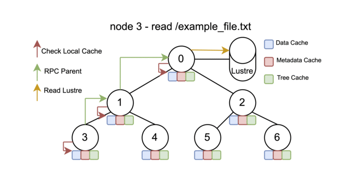

The Data movement section will be classified into 5 sub sections

1. Moving data around Lustre File System - Flare, Gecko and Home directories
2. SCP
3. Globus
4. Copper for scalable data loading
5. DAOS data mover

## 1. Moving data around Lustre File System - Flare, Gecko and Home directories

Not recommended to run jobs from home.

using -l filesystems=daos_user:home:flare -l daos=daos_user options in the qsub

## 2. SCP

https://docs.alcf.anl.gov/aurora/data-management/moving_data_to_aurora/scp/

## 3. Globus

https://docs.alcf.anl.gov/aurora/data-management/moving_data_to_aurora/globus/

## 4. Copper for scalable data loading

Copper is a **read-only** cooperative caching layer aimed to enable scalable data loading on massive amounts of compute nodes. This aims to avoid the I/O bottleneck in the storage network and effectively use the compute network for data movement.

The current intended use of copper is to improve the performance of python imports - dynamic shared library loading on Aurora. However, copper can used to improve the performance of any type of redundant data loading on a supercomputer.

The default modules and its associated libraries are on the compute image mounted through squash FS - Not lustre flare. If you prefer to load any other custom modules or newer python packages from lustre flare at scale, then you should use copper.

It is recommended to use copper for any applications [preferrably python and I/O <500 MB] in order to scale beyond 2k nodes.



Basically, instead of all the nodes directly contacting and loading the files from lustre, only 1 node will contact and load from lustre and distribute it to the other nodes.

Performance comparison of import torch with and without copper (lustre results can vary or observe higher when there is contention and interference on lustre or storage network)

| num nodes | num ranks per node | without copper import torch time from lustre | with copper import torch time |
| :-------: | :----------------: | -------------------------------------------- | ------------------------------ |
|    64    |         12         | 105 seconds                                  | 50 seconds                    |
|    128    |         12         | 110 seconds                                 | 52 seconds                    |
|    256    |         12         | 110 seconds                                 | 54 seconds                    |
|    512    |         12         | 115 seconds                                  | 56 seconds                    |
|   1024   |         12         | 4 minutes                                    | 58 seconds                    |
|   2048   |         12         | 7 minutes                                    | 58 seconds                    |
|   4096   |         12         | 8 minutes                                    | 59 seconds                    |
|   8192   |         12         | 17 minutes                                   | 60 seconds                    |

#### How to use copper on Aurora

```
module load copper
launch_copper.sh
```

Then run your mpiexec as you would normally run.

If you want your I/O to go through copper, add `/tmp/${USER}/copper/` to the begining of your PATHS. Here only the root compute node will do the I/O directly with the lustre file system.
If `/tmp/${USER}/copper/` is not added to the begining of your paths, then all compute nodes would do I/O directly to the lustre file system.

For example, if you have a local conda environment located in a path at `/lus/flare/projects/Aurora_deployment/kaushik/copper/oct24/copper/run/copper_conda_env`, you need to prepath the copper path as `/tmp/${USER}/copper/lus/flare/projects/Aurora_deployment/kaushik/copper/oct24/copper/run/copper_conda_env`.
The same should be done for any type of PATHS, like PYTHONPATH, CONDAPATH and your input file path.

Python Example

```
time mpirun --np ${NRANKS} --ppn ${RANKS_PER_NODE} --cpu-bind=list:4:9:14:19:20:25:56:61:66:71:74:79 --genvall\
            --genv=PYTHONPATH=/tmp/${USER}/copper/lus/flare/projects/Aurora_deployment/kaushik/copper/oct24/copper/run/copper_conda_env\
	    python3 -c "import numpy; print(numpy.__file__)"
```

Non python example

```
time mpiexec --np $ranks -ppn 12 --cpu-bind=list:4:9:14:19:20:25:56:61:66:71:74:79 --no-vni --genvall\
		/lus/flare/projects/CSC250STDM10_CNDA/kaushik/thunder/svm_mpi/run/aurora/wrapper.sh \
		/lus/flare/projects/CSC250STDM10_CNDA/kaushik/thunder/svm_mpi/build_ws1024/bin/thundersvm-train \ 
			-s0 -t2 -g1 -c10 -o1 /tmp/${USER}/copper/lus/flare/projects/CSC250STDM10_CNDA/kaushik/thunder/svm_mpi/data/sc-40-data/real-sim_M100000_K25000_S0.836
```

Finally, you can add an optional `stop_copper.sh`

#### Copper Options

```
-l log_level	[Allowedvalues:6[nologging],5[lesslogging],4,3,2,1[morelogging]][Default:6]
-t log_type	[Allowedvalues:fileorfile_and_stdout][Default:file]
-T trees	[Allowedvalues:anynumber][Default:1]
-M max_cacheable_byte_size	[Allowedvalues:anynumberinbytes][Default:10MB]
-s sleeptime	[Allowedvalues:Anynumber][Default:20seconds]Recommendedtouse60secondsfor4knodes
-b physcpubind		[Allowedvalues:"CORE NUMBER-CORE NUMBER"][Default:"48-51"]
```

For example, you can change the default values to

```
launch_copper.sh -l 2 -t stdout_and_file -T 2 -s 40
```

#### Example program - with and without copper under copper_example directory

#### Notes

* Copper currently does not support write operation.
* Only the follow file system operations are supported : init, open, read, readdir, readlink, getattr, ioctl, destroy
* Copper works only from the compute nodes and you need a minimum of 2 nodes up to a max of any number of nodes ( Aurora max 10624 nodes)
* Recommended trees is 1 or 2.
* Recommended size for max cachable byte size is 10MB to 100MB.
* To be used only from the compute node.
* More examples at https://github.com/argonne-lcf/copper/tree/main/examples/example3 and https://alcf-copper-docs.readthedocs.io/en/latest/.

#### Reference

Noah Lewis, Kaushik Velusamy, Kevin Harms, Huihuo Zheng, “*Copper: Cooperative Caching Layer for Scalable Data Loading in Exascale Supercomputers*”, 9th International Parallel Data Systems Workshop held in conjunction with the 2024 International Conference for High Performance Computing, Networking, Storage, and Analysis.

## 5. DAOS data mover

#### Once the container is mounted, you can use cp, daos filesystem copy or dcp

using CP

```
cp /lus/flare/projects/CSC250STDM10_CNDA/kaushik/thundersvm/input_data/real-sim_M100000_K25000_S0.836 /tmp/${DAOS_POOL}/${DAOS_CONT}
```

#### using daos filesystem copy

```
daos filesystem copy--src /lus/flare/projects/CSC250STDM10_CNDA/kaushik/thundersvm/input_data/real-sim_M100000_K25000_S0.836 --dst daos://tmp/${DAOS_POOL}/${DAOS_CONT}
```

You may have to replace the DAOS_POOL and DAOS_CONT label with its UUIDs. UUIDs can be copied from

```
daos pool query ${DAOS_POOL}
daos container query $DAOS_POOL_NAME $DAOS_CONT_NAME
```

#### using mpifileutils distributed CP (DCP)

You can also use other mpifileutils binaraies.

```
mpifileutils/bin>ls 
dbcast  dbz2  dchmod  dcmp  dcp  dcp1  ddup  dfilemaker1  dfind  dreln  drm  dstripe  dsync  dtar  dwalk
```

Ref: https://docs.daos.io/v2.4/testing/datamover/
