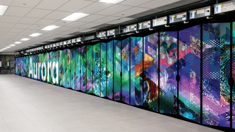
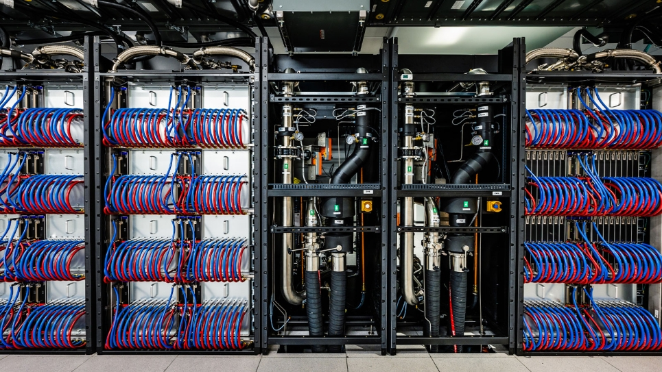
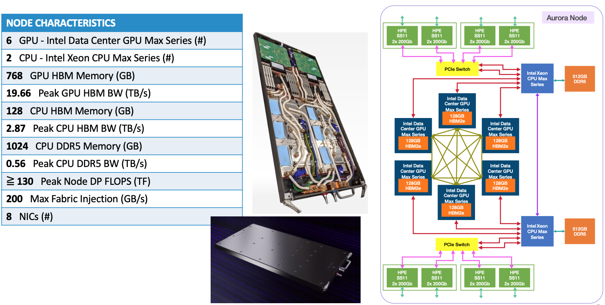
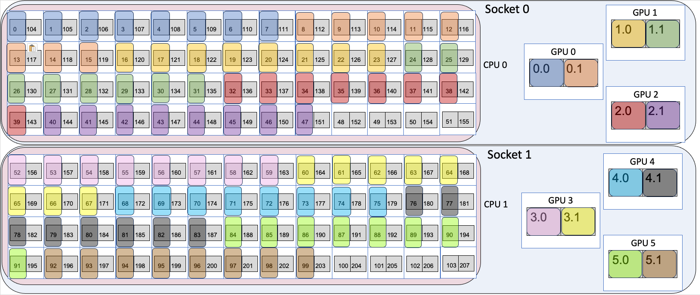
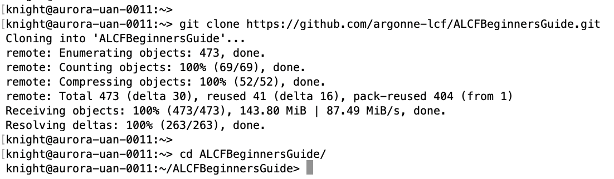
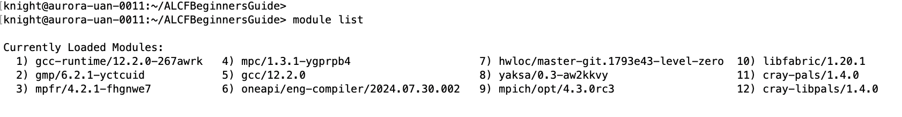
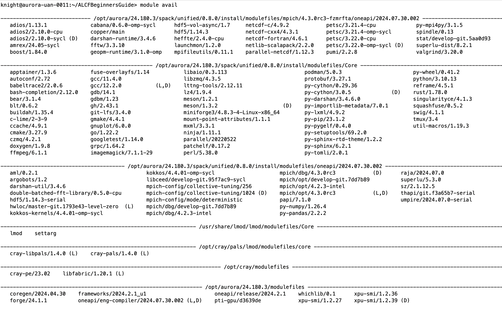
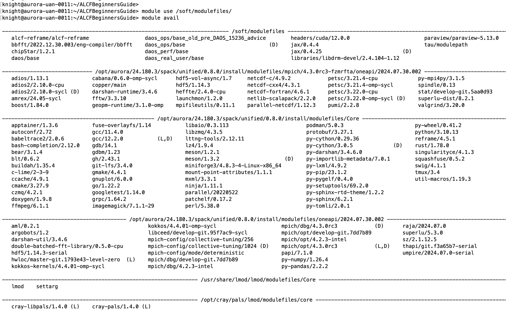
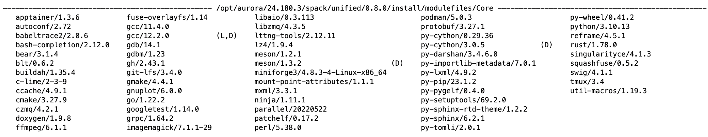

# Aurora Beginners Guide

This guide aims to introduce researchers with coding experience on clusters and/or supercomputers to the specifics of using ALCF systems.

### Users of this guide are assumed to know:
* basic linux terminal usage
* basic cluster scheduling
* basic code compilation
### Learning Goals:
* Use `module` command to inspect and modify the shell environment


## [Aurora](https://www.alcf.anl.gov/aurora)



The inside of Aurora again shows the _nodes_ stacked up in each closet along with mechanical equipment to cooling water through the system.



Aurora is an Intel GPU -based system.

Aurora Machine Specs
* Speed: 
  * [HPL](https://top500.org/system/180183/): 1.012 exaflops 
  * [HPL-MxP](https://hpl-mxp.org/results.md): 10.6 exaflops
* 10,624 Total Nodes
  * 166 Cabinets
  * 1.36 PB HBM CPU Capacity
  * 10.9 PB DDR5 Capacity
  * 8.16 PB HBM GPU Capacity
* Each Node has:
  * 6 Intel Data Center GPU Max Series GPUs
  * 2 Intel Xeon CPU Max Series processors (52 cores each)
  * 8 Slingshot 11 fabric endpoints


Additional details on the connectivity and performance characteristics of a single Aurora Exascale Compute Blade (ECB) follows. The GPUs are connected in an all-to-all fashion. There are two sets of three GPUs that have a direct PCIe connection to one of the CPUs. The two CPUs are connected with UPI and each has 512 GB DDR and 128 GB HBM memory. Each CPU is connected to PCIe switch that fans out to 4 Slingshot 11 Network Interface Cards (NICs).



The image below shows a deeper dive into the physical hardware from the perspective of how an application might see the compute node. Though not quite correct, we can think of the compute blade as consisting of two sockets, each having a 52-core CPU and 3 GPUs. Each CPU core supports 2 hyperthreads. The GPUs physically consist of two tiles with a fast interconnect and many applications may be benefit by binding processes to individual tiles as indicated by the color assignments (one of many possibilities).



## Logging in:

Login using `ssh` replacing `<username>` with your ALCF username
```bash
ssh <username>@aurora.alcf.anl.gov
```


You will be prompted for your password, which is a six digit code generated uniquely each time using the MobilePASS+ app. 

## Quick filesystem breakdown

When you login, you start in your _home_ directory: `/home/<username>/` (1TB default starting quota). Note, this home directory is currently specific to Aurora and differs from your _home_ accessible from other ALCF systems (e.g. Polaris). 
As an ALCF user you will be assigned access to different allocation _projects_. You can see your projects listed on the [ALCF Accounts Page](accounts.alcf.anl.gov). Each project maps to a user group to control filesystem access, so you can also check your projects using the `groups` command on the terminal. Projects are given storage spaces on our Flare Lustre filesystem where all members of the project can read/write and share data/software:
* `/lus/flare/projects/<project-name>`

Users should use project spaces for large scale storage and software installations. Increases can be requested via `support@alcf.anl.gov`.

Upon request, users can also utilize the DAOS filesystem in Aurora for increased performance. 

## Clone repo:

Next, clone this repository into your home directory using:
```bash
git clone https://github.com/argonne-lcf/ALCFBeginnersGuide.git
cd ALCFBeginnersGuide
```



## Getting to know the environment

ALCF uses [Environment Modules](https://modules.readthedocs.io/en/latest/index.html) to provide users with loadable software packages. This includes compilers, python installations, and other software. Here are some basic commands:

`module list`: lists all currently loaded modules


`module avail`: lists the available modules that can be loaded. What modules are available is controled by the `MODULEPATH` environment variable. The colon-seperated list of paths are scanned for module files. When you first login, this only contains system modules from HPE/Cray/etc. If the list is too long for your screen, you can use `less`-like commands to navigate (arrow keys, space bar, etc.).



By default, `MODULEPATH` only includes system libraries from Intel/HPE. One can include pre-built modules from ALCF staff by adding the path `/soft/modulefiles` to `MODULEFILE` using either of these commands:
```bash
export MODULEPATH=$MODULEPATH:/soft/modulefiles
# OR
module use /soft/modulefiles
```

After doing this, you will find additional modules listed.


## Loading modules

Now we can "load modules" which simply executes some simple bash commands to add paths to prebuilt software into our environment variables such as `PATH` and `LD_LIBRARY_PATH`, thus making the software easily available for compilation or use.

```bash
module load cmake
```

When one first logs in to Aurora, the Intel HPC environment is loaded and what we expect most users will use. 

## Using Spack
Spack is an HPC oriented build management system. [Documentation can be found here.](https://spack.readthedocs.io/en/latest/) In this case of this quick introduction, Spack is simply used to offer additional pre-compiled software.

On Aurora, these additional spack packages are made available by default from the `/soft/modulefiles` area:
```bash 
module use /soft/modulefiles
```




## [NEXT ->](00_scheduler.md)

